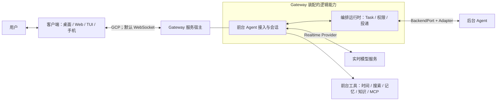

# 00：先建立系统地图

[返回伴读入口](README.md) · 下一章：[Python 到 JavaScript](01-python-to-javascript.md)

## 1. 用一个场景认识项目

你对助手说：“帮我检查这个项目为什么测试失败。”助手受理工作；后台去读文件、运行命令。你可以继续问另一个问题。后台完成之后，助手等当前说话和播放进入合适窗口，再把结果说出来。

这个项目主要解决的是**实时交流与持续执行如何并行，并且保持一个连贯的用户体验**。它提供语音会话、工具调用、任务状态、权限、结果投递、客户端连接及可替换的模型和后台接口。具体模型推理与后台 Agent 的内部执行算法由接入的服务提供。

最重要的代码依据：[AgentTaskRuntime.executeSpawnThinkingToolCall](https://github.com/QwenAudio/qwen-audio-agent/blob/f6dd0e3703d58e4941159c1be89447f3fcb5063a/server/src/frontend/tools/agent-task-runtime.mjs#L195)、[TaskOperations.submit](https://github.com/QwenAudio/qwen-audio-agent/blob/f6dd0e3703d58e4941159c1be89447f3fcb5063a/server/src/orchestration/task-operations.mjs#L57)、[TaskManager.create / #create](https://github.com/QwenAudio/qwen-audio-agent/blob/f6dd0e3703d58e4941159c1be89447f3fcb5063a/server/src/task/task-manager.mjs#L428)、[SessionTaskCoordinator](https://github.com/QwenAudio/qwen-audio-agent/blob/f6dd0e3703d58e4941159c1be89447f3fcb5063a/server/src/orchestration/session-task-coordinator.mjs#L12)。受理不等待后台完成的细节见[流程 B](flows/tasks-permissions-and-delivery.md)。

## 2. 四个词必须先分清

| 词 | 本项目中的含义 | Python 类比 |
| --- | --- | --- |
| 前台 Agent / Frontend Agent | 实时模型 + 指令 + 上下文 + 可用工具，理解输入、决定调用工具、组织自然回复 | 一个面向对话的模型服务客户端及其上下文 |
| 编排运行时 / Orchestration Runtime | 用代码管理 Task、权限、会话、调度、事件和结果投递 | 业务服务、状态机与任务调度器的集合 |
| 后台 Agent / Backend Agent | 用户配置的办事 Agent，经 `BackendPort` 接入，使用自己的模型和工具持续执行 | 通过统一接口调用的外部执行服务或子进程 |
| Client Environment / 客户端 | 采集麦克风、显示消息、播放音频、接收用户操作、管理本地环境 | UI / 终端 / 设备端 |

**Gateway 是把运行时能力装配并对外提供服务的宿主。** 它不是一个新的模型角色，也不是协议名称。客户端连接 Gateway 使用的是 **Gateway Client Protocol，简称 GCP**；这里的 GCP 与 Google Cloud 无关。

图的实现依据：[createGatewayApplication](https://github.com/QwenAudio/qwen-audio-agent/blob/f6dd0e3703d58e4941159c1be89447f3fcb5063a/server/src/app/gateway-application.mjs#L63)、[createFrontendRuntime](https://github.com/QwenAudio/qwen-audio-agent/blob/f6dd0e3703d58e4941159c1be89447f3fcb5063a/server/src/app/frontend-runtime.mjs#L12)、[createRealtimeSessionRuntime](https://github.com/QwenAudio/qwen-audio-agent/blob/f6dd0e3703d58e4941159c1be89447f3fcb5063a/server/src/voice/realtime-session-runtime.mjs#L56)、[BACKEND_PORT_METHODS / assertBackendPort](https://github.com/QwenAudio/qwen-audio-agent/blob/f6dd0e3703d58e4941159c1be89447f3fcb5063a/server/src/backend/backend-port.mjs#L22)。逻辑组件与进程数量不一一对应；桌面可以启动 Gateway 子进程，后台可以是受管本机进程，也可以是外部服务。

## 3. 两条主线决定阅读顺序

**对话主线：**客户端采集输入 → Gateway 接入 → 会话运行时 → Realtime Provider → 模型产生音频或工具调用 → 客户端展示和播放。先看[流程 A](flows/voice-and-tools.md)。

**工作主线：**模型调用 `spawn_thinking` → 本地创建 Task → 返回 `accepted` → 队列调度 → 后台执行 → 状态与产物回流 → 通知被领取 → 等待播报窗口 → 客户端确认开始播放。再看[流程 B](flows/tasks-permissions-and-delivery.md)。

不能把“工具调用”“后台任务”和“结果通知”合成一个等待返回的 HTTP 请求。三者有不同生命周期。Task 完成时，结果可能还没播放；当前语音断开时，已受理工作仍可能继续。

## 4. 看到术语时先翻译成具体行为

| 术语 | 读代码时的意思 |
| --- | --- |
| Provider | 封装一类可替换能力，例如实时模型、记忆存储、知识检索 |
| Adapter | 把外部协议转换为内部接口，例如 ACP / A2A → BackendPort |
| Port | 业务层依赖的接口契约；调用方不应知道底层供应商协议 |
| Runtime | 持有状态、依赖与生命周期的运行对象或模块集合 |
| Composition root / 装配入口 | 创建服务对象、把接口实现注入调用方的地方，核心是 `app/` |
| Projection / 投影 | 把内部事件或状态转换成公开、可展示的数据 |
| ownerId | 可信用户归属标识，来自接入身份；查询与操作按它隔离 |
| sessionId | 当前语境的会话标识；客户端逻辑会话、前台连接和后台原生 Session 要分别看 |
| turnId / responseId / callId / taskId | 用户轮次 / 模型响应 / 工具调用 / 持续工作的不同关联 ID |
| claim / lease | 暂时领取或占有某项资源，有身份与过期时间，可释放或续期 |
| artifact | 文件、图片、结构化数据等可展示的工作产物 |

协议证据：[GATEWAY_CLIENT_PROTOCOL_VERSION / protocol definitions](https://github.com/QwenAudio/qwen-audio-agent/blob/f6dd0e3703d58e4941159c1be89447f3fcb5063a/shared/protocol/gateway-client-protocol.mjs#L13)、[TaskStatus / TRANSITIONS](https://github.com/QwenAudio/qwen-audio-agent/blob/f6dd0e3703d58e4941159c1be89447f3fcb5063a/server/src/task/task-state.mjs#L5)、[TaskNotificationQueue](https://github.com/QwenAudio/qwen-audio-agent/blob/f6dd0e3703d58e4941159c1be89447f3fcb5063a/server/src/task/task-notification-queue.mjs#L8)。不同 ID 不能互换；尤其不能用某条模型响应结束，推断整个后台 Task 已完成。

## 5. 第一次可以暂缓的部分

第一次深读集中在 `server/src/app`、`frontend/tools`、`task`、`orchestration`、`voice` 与 `backend`。理解链路之后，再读记忆、知识库和客户端。

桌面皮肤动画、发布签名、全部后台驱动、全部模型协议和场景 benchmark 放在后面。它们对完整工程有价值，但不是理解核心控制流的前置条件。示例中的业务规则属于示例；不要把航空退款政策当成框架逻辑。

**读完检查：**你能分别解释“客户端已连接”“模型可用”“Task 已受理”“工作已完成”和“结果已开始播放”吗？这五个判断各自需要不同证据。
