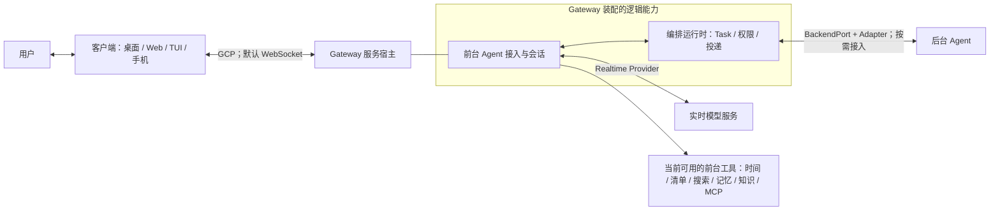

# 00：先建立系统地图

[返回伴读入口](README.md) · 下一章：[Python 到 JavaScript](01-python-to-javascript.md)

## 1. 项目首先要提供什么体验

**qwen-audio-agent 是让 Agent 持续交流、持续工作、持续在场的实时语音运行时。** 用户通过语音与同一个助理交流：它能倾听、回应、支持自然打断和持续多轮对话；当请求需要实际办事时，还能接入已有 Agent 执行工作。工作进行期间，对话继续；结果回来后，助理结合当前语境自然地告诉用户。

这是[项目 README 的产品定位](https://github.com/QwenAudio/qwen-audio-agent/blob/f6dd0e3703d58e4941159c1be89447f3fcb5063a/README_ZH.md#L14)。理解它应先从**实时交流的体验**开始，再看前台工具和后台任务怎样支持这段交流。全双工、打断、工具与视觉等具体能力还取决于所选模型、客户端和配置，不能把一套组合的能力套到所有接入方式。

当前框架重点面向桌面办公，提供 WebUI、TUI 和桌面悬浮球；也有智能座舱、客服、X-Omni 等[场景扩展示例](https://github.com/QwenAudio/qwen-audio-agent/blob/f6dd0e3703d58e4941159c1be89447f3fcb5063a/README_ZH.md#L201)。办公中的文档、文件和代码处理，是办事能力的具体用途；场景里的导航、退款等业务由接入的工具和服务实现。框架提供对话、工具接入、任务编排、权限、结果投递和客户端连接，模型推理与后台内部执行算法由接入服务提供。

## 2. 用一次日常使用串起三种处理方式

下面是帮助理解的办公场景（**teaching**），假设已接入语音模型、启用清单工具，并配置了能处理会议记录的后台 Agent。

| 你说什么 | 用户看到或听到什么 | 主要处理方式 |
| --- | --- | --- |
| “我们聊聊下一场会议怎么安排。”中途补充：“先讲最重要的两点。” | 助理在当前对话里回答，并按新的话语继续交流 | 前台实时对话；无需创建后台 Task |
| “把准备会议材料加入待办清单。” | 助理调用可用的清单工具，按真实结果确认 | 前台直接使用工具；无需后台 Agent |
| “把工作目录中的会议记录整理成一份纪要文件，列出行动项。” | 助理受理文件工作；你仍能继续交流或询问进度；结果回来后自然转达 | 后台持续执行，运行时安排状态与结果回流 |

这里要理解的是**用户面对一个连续在场的助理，但不同请求走不同路径**。普通交流、前台工具、后台工作是三个需要区分的分支；后台也可以不配置，先使用仅前台模式。

分支规则见 [PROMPT 的 Routing](https://github.com/QwenAudio/qwen-audio-agent/blob/f6dd0e3703d58e4941159c1be89447f3fcb5063a/config/frontend-agent/PROMPT.md#L24)和[架构中的实时边界](../architecture/deep-dive.zh.md)。清单行为见 [personal-tools.mjs](https://github.com/QwenAudio/qwen-audio-agent/blob/f6dd0e3703d58e4941159c1be89447f3fcb5063a/server/src/frontend/tools/features/personal-tools.mjs#L1)；后台受理与结果回流见[流程 B](flows/tasks-permissions-and-delivery.md)。这些源码证明处理机制，不能保证某个外部 Agent 一定能完成示例中的文档工作。

## 3. 四个词必须先分清

| 词 | 本项目中的含义 | Python 类比 |
| --- | --- | --- |
| 前台 Agent / Frontend Agent | 实时模型 + 指令 + 上下文 + 可用工具，理解输入、决定调用工具、组织自然回复 | 一个面向对话的模型服务客户端及其上下文 |
| 编排运行时 / Orchestration Runtime | 用代码管理 Task、权限、会话、调度、事件和结果投递 | 业务服务、状态机与任务调度器的集合 |
| 后台 Agent / Backend Agent | 用户配置的办事 Agent，经 `BackendPort` 接入，使用自己的模型和工具持续执行 | 通过统一接口调用的外部执行服务或子进程 |
| Client Environment / 客户端 | 采集麦克风、显示消息、播放音频、接收用户操作、管理本地环境 | UI / 终端 / 设备端 |

**Gateway 是把运行时能力装配并对外提供服务的宿主。** 它不是一个新的模型角色，也不是协议名称。客户端连接 Gateway 使用的是 **Gateway Client Protocol，简称 GCP**；这里的 GCP 与 Google Cloud 无关。

图的实现依据：[createGatewayApplication](https://github.com/QwenAudio/qwen-audio-agent/blob/f6dd0e3703d58e4941159c1be89447f3fcb5063a/server/src/app/gateway-application.mjs#L63)、[createFrontendRuntime](https://github.com/QwenAudio/qwen-audio-agent/blob/f6dd0e3703d58e4941159c1be89447f3fcb5063a/server/src/app/frontend-runtime.mjs#L12)、[createRealtimeSessionRuntime](https://github.com/QwenAudio/qwen-audio-agent/blob/f6dd0e3703d58e4941159c1be89447f3fcb5063a/server/src/voice/realtime-session-runtime.mjs#L56)、[BACKEND_PORT_METHODS / assertBackendPort](https://github.com/QwenAudio/qwen-audio-agent/blob/f6dd0e3703d58e4941159c1be89447f3fcb5063a/server/src/backend/backend-port.mjs#L22)。逻辑组件与进程数量不一一对应；桌面可以启动 Gateway 子进程，后台可以是受管本机进程，也可以是外部服务。

## 4. 先读对话，再读办事；留意工具分支

**对话主线：**客户端采集输入 → Gateway 接入 → 会话运行时 → Realtime Provider → 模型产生音频或工具调用 → 客户端展示和播放。先看[流程 A](flows/voice-and-tools.md)。

**前台工具分支：**模型需要当前可用的工具 → ToolCallHandler 校验并执行 → 工具结果返回模型 → 模型继续回复。例如清单、记忆或配置好的查询工具，可以在前台完成；工具调用不必创建后台 Task。见[流程 A 第 5 节](flows/voice-and-tools.md#5-一次工具调用的真实入口)。

**后台工作分支：**请求需要后台能力 → 模型调用 `spawn_thinking` → 本地创建 Task → 返回 `accepted` → 后台异步执行 → 状态与产物回流 → 运行时安排通知与播报。理解前两种路径之后，再看[流程 B](flows/tasks-permissions-and-delivery.md)。

不能把“工具调用”“后台任务”和“结果通知”合成一个等待返回的 HTTP 请求。三者有不同生命周期。Task 完成时，结果可能还没播放；当前语音断开时，已受理工作仍可能继续。

## 5. 看到术语时先翻译成具体行为

| 术语 | 读代码时的意思 |
| --- | --- |
| Provider | 封装一类可替换能力，例如实时模型、记忆存储、知识检索 |
| Adapter | 把外部协议转换为内部接口，例如 ACP / A2A → BackendPort |
| Port | 业务层依赖的接口契约；调用方不应知道底层供应商协议 |
| Runtime | 持有状态、依赖与生命周期的运行对象或模块集合 |
| Composition root / 装配入口 | 创建服务对象、把接口实现注入调用方的地方，核心是 `app/` |
| Projection / 投影 | 把内部事件或状态转换成公开、可展示的数据 |
| ownerId | 可信用户归属标识，来自接入身份；查询与操作按它隔离 |
| sessionId | 当前语境的会话标识；客户端逻辑会话、前台连接和后台原生 Session 要分别看 |
| turnId / responseId / callId / taskId | 用户轮次 / 模型响应 / 工具调用 / 持续工作的不同关联 ID |
| claim / lease | 暂时领取或占有某项资源，有身份与过期时间，可释放或续期 |
| artifact | 文件、图片、结构化数据等可展示的工作产物 |

协议证据：[GATEWAY_CLIENT_PROTOCOL_VERSION / protocol definitions](https://github.com/QwenAudio/qwen-audio-agent/blob/f6dd0e3703d58e4941159c1be89447f3fcb5063a/shared/protocol/gateway-client-protocol.mjs#L13)、[TaskStatus / TRANSITIONS](https://github.com/QwenAudio/qwen-audio-agent/blob/f6dd0e3703d58e4941159c1be89447f3fcb5063a/server/src/task/task-state.mjs#L5)、[TaskNotificationQueue](https://github.com/QwenAudio/qwen-audio-agent/blob/f6dd0e3703d58e4941159c1be89447f3fcb5063a/server/src/task/task-notification-queue.mjs#L8)。不同 ID 不能互换；尤其不能用某条模型响应结束，推断整个后台 Task 已完成。

## 6. 第一次可以暂缓的部分

第一次先沿客户端音频入口、`server/src/voice` 与 Realtime Provider 追踪一次普通对话；再用 `server/src/app` 确认装配，用 `frontend/tools` 追一个前台工具。最后进入 `task`、`orchestration` 与 `backend`，理解持续工作的执行和回流。记忆、知识库与各客户端细节可以在主路径之后展开。

桌面皮肤动画、发布签名、全部后台驱动、全部模型协议和场景 benchmark 放在后面。它们对完整工程有价值，但不是理解核心控制流的前置条件。示例中的业务规则属于示例；不要把航空退款政策当成框架逻辑。

**读完检查：**你能用自己的话说清产品目标，并分别举出直接对话、前台工具、后台工作的例子吗？然后再区分“客户端已连接”“模型可用”“Task 已受理”“工作已完成”和“结果已开始播放”：这五个判断各自需要不同证据。
