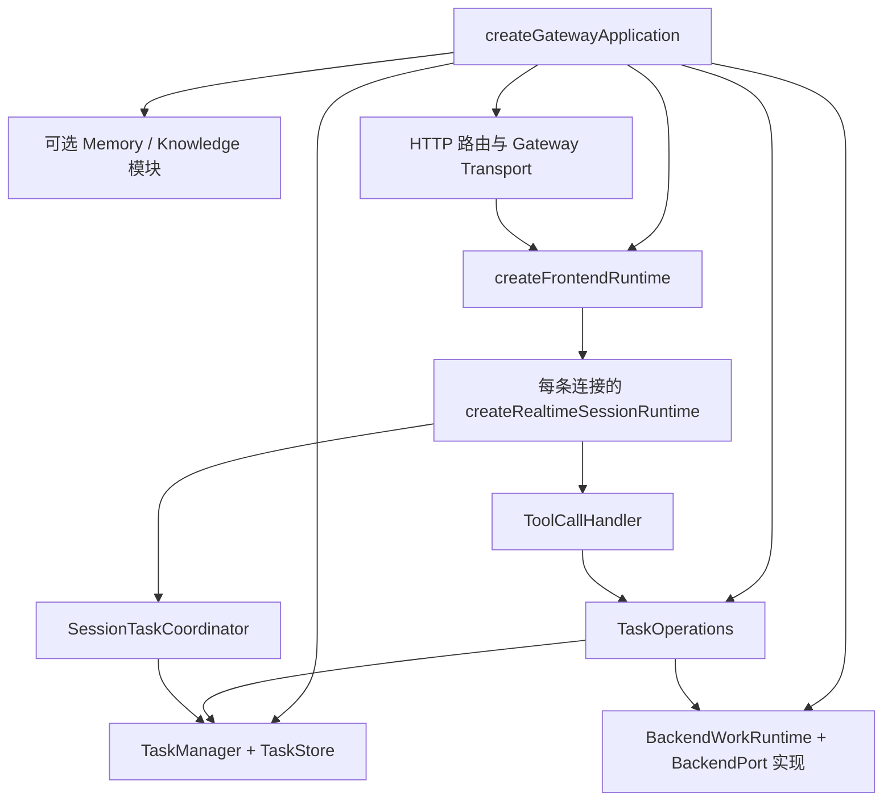

# 03：架构、进程与执行入口

[返回伴读入口](README.md) · 下一步：[语音流程](flows/voice-and-tools.md)

## 1. 目录是一张职责地图

| 目录 | 拥有的职责 | 首先阅读 |
| --- | --- | --- |
| `cli/` | 命令解析、配置、启动与服务管理 | [CLI executable](https://github.com/QwenAudio/qwen-audio-agent/blob/f6dd0e3703d58e4941159c1be89447f3fcb5063a/cli/bin/qwenaudio.mjs#L1)、[main](https://github.com/QwenAudio/qwen-audio-agent/blob/f6dd0e3703d58e4941159c1be89447f3fcb5063a/cli/src/launcher.mjs#L220) |
| `server/src/app/` | 创建共享服务、注入依赖、注册接入与整体关闭 | [createGatewayApplication](https://github.com/QwenAudio/qwen-audio-agent/blob/f6dd0e3703d58e4941159c1be89447f3fcb5063a/server/src/app/gateway-application.mjs#L63)、[createFrontendRuntime](https://github.com/QwenAudio/qwen-audio-agent/blob/f6dd0e3703d58e4941159c1be89447f3fcb5063a/server/src/app/frontend-runtime.mjs#L12) |
| `server/src/frontend/` | 前台指令、工具定义与执行、网页检索 | [frontendTools](https://github.com/QwenAudio/qwen-audio-agent/blob/f6dd0e3703d58e4941159c1be89447f3fcb5063a/server/src/frontend/frontend-tools.mjs#L109)、[ToolCallHandler](https://github.com/QwenAudio/qwen-audio-agent/blob/f6dd0e3703d58e4941159c1be89447f3fcb5063a/server/src/frontend/tools/tool-call-handler.mjs#L78) |
| `server/src/voice/` | 每条前台连接的模型、音频轮次、响应、播放与恢复 | [createRealtimeSessionRuntime](https://github.com/QwenAudio/qwen-audio-agent/blob/f6dd0e3703d58e4941159c1be89447f3fcb5063a/server/src/voice/realtime-session-runtime.mjs#L56)、[RealtimeFrontend](https://github.com/QwenAudio/qwen-audio-agent/blob/f6dd0e3703d58e4941159c1be89447f3fcb5063a/server/src/voice/realtime-provider.mjs#L111) |
| `server/src/orchestration/` | 共用用户任务操作、会话级投递协调 | [TaskOperations](https://github.com/QwenAudio/qwen-audio-agent/blob/f6dd0e3703d58e4941159c1be89447f3fcb5063a/server/src/orchestration/task-operations.mjs#L34)、[SessionTaskCoordinator](https://github.com/QwenAudio/qwen-audio-agent/blob/f6dd0e3703d58e4941159c1be89447f3fcb5063a/server/src/orchestration/session-task-coordinator.mjs#L12) |
| `server/src/task/` | Task 状态、排队、权限策略、提醒、持久化和通知领取 | [TaskManager](https://github.com/QwenAudio/qwen-audio-agent/blob/f6dd0e3703d58e4941159c1be89447f3fcb5063a/server/src/task/task-manager.mjs#L56)、[TaskStatus / TRANSITIONS](https://github.com/QwenAudio/qwen-audio-agent/blob/f6dd0e3703d58e4941159c1be89447f3fcb5063a/server/src/task/task-state.mjs#L5) |
| `server/src/backend/` | BackendPort 与通用执行门面；具体协议在 adapters | [BACKEND_PORT_METHODS / assertBackendPort](https://github.com/QwenAudio/qwen-audio-agent/blob/f6dd0e3703d58e4941159c1be89447f3fcb5063a/server/src/backend/backend-port.mjs#L22)、[BackendWorkRuntime](https://github.com/QwenAudio/qwen-audio-agent/blob/f6dd0e3703d58e4941159c1be89447f3fcb5063a/server/src/backend/backend-work-runtime.mjs#L14) |
| `server/src/client/`、`transport/` | 客户端命令 / 环境动作，与网络连接 / 协议投影 | [GatewayClientCommandRuntime](https://github.com/QwenAudio/qwen-audio-agent/blob/f6dd0e3703d58e4941159c1be89447f3fcb5063a/server/src/client/client-command-runtime.mjs#L39)、[attachGatewayClientTransport](https://github.com/QwenAudio/qwen-audio-agent/blob/f6dd0e3703d58e4941159c1be89447f3fcb5063a/server/src/transport/gateway-client-transport.mjs#L62) |
| `memory/`、`knowledge/`、`conversation/`、`session/` | 记忆、资料、对话上下文与事件日志各自的状态 | [专题](subsystems/memory-knowledge-and-context.md)、[持久化](data/state-and-persistence.md) |
| `access/`、`process/`、`core/` | 接入身份、后台进程、配置日志等基础能力 | [GatewayAccessManager](https://github.com/QwenAudio/qwen-audio-agent/blob/f6dd0e3703d58e4941159c1be89447f3fcb5063a/server/src/access/gateway-access.mjs#L245)、[startManagedBackend](https://github.com/QwenAudio/qwen-audio-agent/blob/f6dd0e3703d58e4941159c1be89447f3fcb5063a/server/src/process/managed-backend.mjs#L181)、[config](https://github.com/QwenAudio/qwen-audio-agent/blob/f6dd0e3703d58e4941159c1be89447f3fcb5063a/server/src/core/config.mjs#L234) |
| `shared/` | 客户端 SDK、协议、路径、配置与跨进程基础能力 | [GatewayClient](https://github.com/QwenAudio/qwen-audio-agent/blob/f6dd0e3703d58e4941159c1be89447f3fcb5063a/shared/gateway/client-sdk.mjs#L63)、[GATEWAY_CLIENT_PROTOCOL_VERSION / protocol definitions](https://github.com/QwenAudio/qwen-audio-agent/blob/f6dd0e3703d58e4941159c1be89447f3fcb5063a/shared/protocol/gateway-client-protocol.mjs#L13) |
| `web/`、`desktop/`、`tui/`、`mobile/` | 各客户端的 I/O、展示与本地生命周期 | [客户端专题](subsystems/clients-and-extensions.md) |
| `examples/` | 特定业务与外部服务集成 | 智能座舱、客服、LightRAG 等各自 README |

阅读 `server/src/README.md` 能快速定位，但业务调用可能横跨数个领域。`orchestration/` 不等于全部编排运行时，`voice/` 也不等于模型供应商 API。

## 2. 从 CLI 启动时实际走哪里

```text
package.json 的 bin：qwenaudio
  → cli/bin/qwenaudio.mjs
  → cli/src/launcher.mjs 的 main
  → runtime / process 启动或复用 Gateway
  → server/src/index.mjs
  → app/bootstrap.mjs
  → createGatewayApplication(...)
```

依据：[CLI executable](https://github.com/QwenAudio/qwen-audio-agent/blob/f6dd0e3703d58e4941159c1be89447f3fcb5063a/cli/bin/qwenaudio.mjs#L1)、[main](https://github.com/QwenAudio/qwen-audio-agent/blob/f6dd0e3703d58e4941159c1be89447f3fcb5063a/cli/src/launcher.mjs#L220)、[Gateway process entry](https://github.com/QwenAudio/qwen-audio-agent/blob/f6dd0e3703d58e4941159c1be89447f3fcb5063a/server/src/index.mjs#L1)、[bootstrap module](https://github.com/QwenAudio/qwen-audio-agent/blob/f6dd0e3703d58e4941159c1be89447f3fcb5063a/server/src/app/bootstrap.mjs#L1)、[createGatewayApplication](https://github.com/QwenAudio/qwen-audio-agent/blob/f6dd0e3703d58e4941159c1be89447f3fcb5063a/server/src/app/gateway-application.mjs#L63)。不同命令不全走这条链路：`config`、`doctor`、WebUI 启动和后台服务管理有独立分支。先确定实际命令，再沿调用者阅读。

`server/src/index.mjs` 负责运行环境、setup gate、Gateway 租约、受管后台、退出信号和生命周期。它不是全部 HTTP / WebSocket 业务代码。异常启动会记录失败；技能补装失败则有自己的非阻塞启动策略，不应混成同一种错误。

## 3. 为什么 createGatewayApplication 是最重要的装配入口

这个工厂函数把 TaskManager、BackendWorkRuntime、TaskOperations、上下文、可选模块、工具来源、客户端命令、前台运行时和传输连起来。调用方可以注入替换实现；缺省路径也能装配正常产品。



核心依据：[createGatewayApplication](https://github.com/QwenAudio/qwen-audio-agent/blob/f6dd0e3703d58e4941159c1be89447f3fcb5063a/server/src/app/gateway-application.mjs#L63)、[TaskOperations](https://github.com/QwenAudio/qwen-audio-agent/blob/f6dd0e3703d58e4941159c1be89447f3fcb5063a/server/src/orchestration/task-operations.mjs#L34)、[createFrontendRuntime](https://github.com/QwenAudio/qwen-audio-agent/blob/f6dd0e3703d58e4941159c1be89447f3fcb5063a/server/src/app/frontend-runtime.mjs#L12)、[createRealtimeSessionRuntime](https://github.com/QwenAudio/qwen-audio-agent/blob/f6dd0e3703d58e4941159c1be89447f3fcb5063a/server/src/voice/realtime-session-runtime.mjs#L56)、[SessionTaskCoordinator](https://github.com/QwenAudio/qwen-audio-agent/blob/f6dd0e3703d58e4941159c1be89447f3fcb5063a/server/src/orchestration/session-task-coordinator.mjs#L12)。依赖通过参数和事件连接；通用运行时不应向下导入具体模型 Provider 或 ACP 实现来选择业务策略。

Python 类比：`create_app()` 创建 service / repository / client，给服务注入接口实现。读它主要是确认“谁创建谁、谁把什么交给谁”，不要在第一遍追入每个构造函数。

装配函数引用具体实现是必要的；通用业务层引用具体实现则会破坏可替换性。[依赖边界测试](../../server/test/dependency-boundaries.test.mjs)检查了这类规则，本次已运行通过。

## 4. 三种对象生命周期

| 生命周期 | 对象 / 资源 | 关闭的意义 |
| --- | --- | --- |
| 应用级 | TaskManager、后台门面、可选模块、工具来源、HTTP / Transport | 服务整体释放资源，按其策略收尾或关闭执行 |
| 前台连接级 | 会话运行时、ToolCallHandler、SessionTaskCoordinator、计时器、投递 claim | 该连接停止收听与投递；已受理的后台工作不会仅因此取消 |
| 单次操作级 | turn、response、tool call、Task runner、permission request | 根据各自的 ID 与状态结束；不能互相替代 |

[createFrontendRuntime](https://github.com/QwenAudio/qwen-audio-agent/blob/f6dd0e3703d58e4941159c1be89447f3fcb5063a/server/src/app/frontend-runtime.mjs#L12) 的 `createSession()` 为连接创建独立运行时，`close()` 关闭所有前台会话并等待生命周期观察器。[createRealtimeSessionRuntime](https://github.com/QwenAudio/qwen-audio-agent/blob/f6dd0e3703d58e4941159c1be89447f3fcb5063a/server/src/voice/realtime-session-runtime.mjs#L56) 管模型与工具，[SessionTaskCoordinator](https://github.com/QwenAudio/qwen-audio-agent/blob/f6dd0e3703d58e4941159c1be89447f3fcb5063a/server/src/orchestration/session-task-coordinator.mjs#L12) 释放订阅和通知 claim。工具来源服务由应用拥有和关闭，不由某次 Socket 握手临时重复发现。

## 5. 接入层与业务层的边界

[attachGatewayClientTransport](https://github.com/QwenAudio/qwen-audio-agent/blob/f6dd0e3703d58e4941159c1be89447f3fcb5063a/server/src/transport/gateway-client-transport.mjs#L62) 处理接入认证、能力、连接归属、协议解码、心跳和公开投影，并调用注入的 frontend runtime。会话运行时接收可信身份与解码事件；它管理模型、音频、上下文、工具和播放，不拥有接入凭据或 GCP 握手。

HTTP 路由注册在 [registerGatewayHttpRoutes](https://github.com/QwenAudio/qwen-audio-agent/blob/f6dd0e3703d58e4941159c1be89447f3fcb5063a/server/src/app/gateway-http-routes.mjs#L30)，装配函数提供依赖。配置、健康、知识库管理等控制面接口，与模型工具调用的行为入口不能混为一谈。前台工具和直接客户端 Task 命令最终共用 [TaskOperations](https://github.com/QwenAudio/qwen-audio-agent/blob/f6dd0e3703d58e4941159c1be89447f3fcb5063a/server/src/orchestration/task-operations.mjs#L34)；公开协议回执各留在自己的入口层。

## 6. 逻辑组件与进程拓扑

- WebUI 是浏览器页面，经网络连接 Gateway。
- TUI 是终端客户端；音频后端根据平台与模式选择。
- 桌面应用是 Electron 主进程与渲染界面；可以管理内置 Gateway，也可以连接独立 Gateway。
- 手机是带原生能力的开发客户端，主要复用 Web 交互；手机接入不意味着后台工作在手机执行。
- 后台 Agent 可以由本机进程驱动管理，也可通过 Adapter 接入外部服务；云端实时模型通常是另一项服务。

证据：[startConfiguredRuntime / Electron main](https://github.com/QwenAudio/qwen-audio-agent/blob/f6dd0e3703d58e4941159c1be89447f3fcb5063a/desktop/src/main.mjs#L390)、[useRealtimeVoice](https://github.com/QwenAudio/qwen-audio-agent/blob/f6dd0e3703d58e4941159c1be89447f3fcb5063a/web/src/realtime/useRealtimeVoice.js#L203)、[runTui](https://github.com/QwenAudio/qwen-audio-agent/blob/f6dd0e3703d58e4941159c1be89447f3fcb5063a/tui/src/index.mjs#L141)、[移动端入口](../../mobile/src/main.jsx)、[startManagedBackend](https://github.com/QwenAudio/qwen-audio-agent/blob/f6dd0e3703d58e4941159c1be89447f3fcb5063a/server/src/process/managed-backend.mjs#L181)、[A2ABackendAdapter](https://github.com/QwenAudio/qwen-audio-agent/blob/f6dd0e3703d58e4941159c1be89447f3fcb5063a/server/src/backend/adapters/a2a/backend-adapter.mjs#L513)。这些是实现支持的拓扑，不是本次已运行的所有部署组合。

**读完检查：**你能从 `createGatewayApplication` 找到同一个 TaskOperations 被交给工具和客户端命令的两个位置，并解释为什么关闭一个 SessionTaskCoordinator 不应该取消所有 Task 吗？
