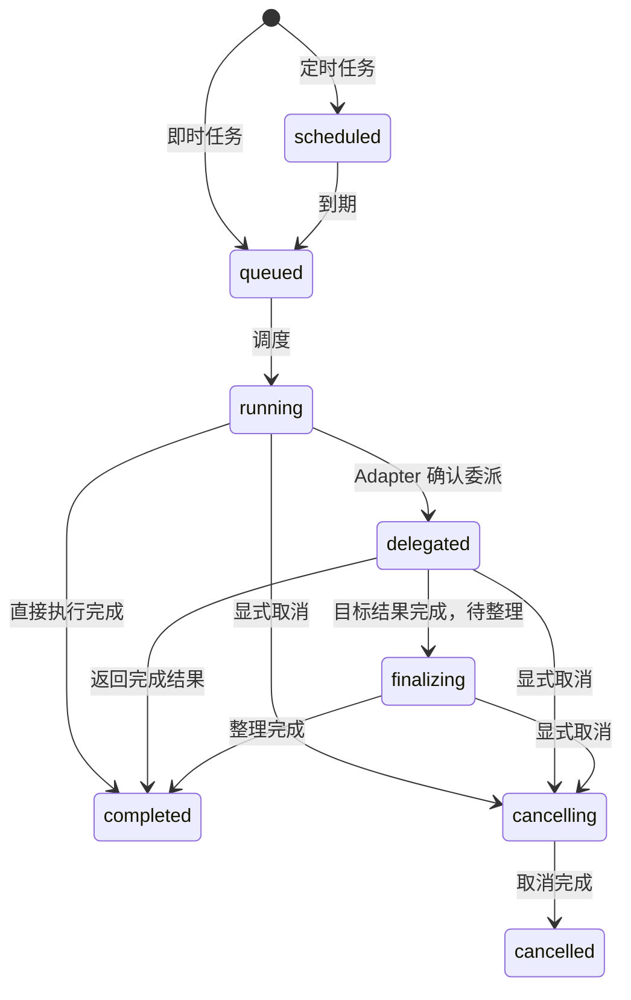
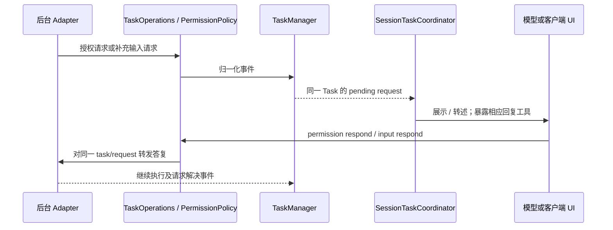

# 流程 B：Task、权限、取消与结果投递

[返回伴读入口](../README.md) · 前置：[语音工具入口](voice-and-tools.md)

本章解释需要后台持续执行时，工作怎样与实时对话协作。普通对话与前台直接调用工具的路径见[流程 A](voice-and-tools.md)；本章从实际调用 `spawn_thinking` 开始。工作链和结果投递链相互关联，但不是同一个生命周期。主流程先按正常音频播报说明，纯文字与主动打断的规则在第 9 节补充。

## 1. 从受理到交付的主路径

```text
spawn_thinking(objective)
  → AgentTaskRuntime 校验、输入引用与重复受理处理
  → TaskOperations.submit
  → TaskManager.create：记录 queued Task，安排 drain，立即返回快照
  → 前台收到 accepted / duplicate 工具回执，继续对话

后续调度
  → TaskManager.start
  → TaskOperations.run
  → BackendWorkRuntime.run
  → BackendPort.submit
  → 后台事件、结果、失败或取消
  → TaskManager 更新状态与产物

结果投递
  → SessionTaskCoordinator 领取通知
  → 播报管理器等待安全窗口
  → 结果进入模型上下文并生成表达
  → 客户端 playback.started
  → TaskManager 标记通知 delivered
```

依据：[AgentTaskRuntime.executeSpawnThinkingToolCall](https://github.com/QwenAudio/qwen-audio-agent/blob/f6dd0e3703d58e4941159c1be89447f3fcb5063a/server/src/frontend/tools/agent-task-runtime.mjs#L195)、[TaskOperations.submit](https://github.com/QwenAudio/qwen-audio-agent/blob/f6dd0e3703d58e4941159c1be89447f3fcb5063a/server/src/orchestration/task-operations.mjs#L57)、[TaskManager.create / #create](https://github.com/QwenAudio/qwen-audio-agent/blob/f6dd0e3703d58e4941159c1be89447f3fcb5063a/server/src/task/task-manager.mjs#L428)、[TaskManager.start](https://github.com/QwenAudio/qwen-audio-agent/blob/f6dd0e3703d58e4941159c1be89447f3fcb5063a/server/src/task/task-manager.mjs#L623)、[BackendWorkRuntime](https://github.com/QwenAudio/qwen-audio-agent/blob/f6dd0e3703d58e4941159c1be89447f3fcb5063a/server/src/backend/backend-work-runtime.mjs#L14)、[SessionTaskCoordinator](https://github.com/QwenAudio/qwen-audio-agent/blob/f6dd0e3703d58e4941159c1be89447f3fcb5063a/server/src/orchestration/session-task-coordinator.mjs#L12)、[AnnouncementManager.deliver](https://github.com/QwenAudio/qwen-audio-agent/blob/f6dd0e3703d58e4941159c1be89447f3fcb5063a/server/src/voice/announcement/announcement-manager.mjs#L351)。图中前台回执和后台调度可能在相邻异步调度中交错；保证在于回执不等待工作最终结果，不在于所有事件严格按图中的墙钟顺序出现。

## 2. `spawn_thinking` 到底转交什么

[spawnThinkingTool](https://github.com/QwenAudio/qwen-audio-agent/blob/f6dd0e3703d58e4941159c1be89447f3fcb5063a/server/src/frontend/tools/spawn-thinking-tool.mjs#L3) 只要求 `objective`，可附历史输入引用 `input_refs`。它不是给模型自由指定后台 Session、权限、driver 或执行计划的接口。

通用链路的模型可见文本需要自包含：例如“继续优化那个页面”应结合当前语境转成明确目标；本轮附件和授权可用的历史附件由输入注册表解析。后台不会默认得到完整前台人格、长期记忆和所有对话内容。场景宿主可以显式增加自己的历史上下文，例如客服示例，但那是额外装配。

[AgentTaskRuntime.executeSpawnThinkingToolCall](https://github.com/QwenAudio/qwen-audio-agent/blob/f6dd0e3703d58e4941159c1be89447f3fcb5063a/server/src/frontend/tools/agent-task-runtime.mjs#L195) 使用缓存的后台可用性快照，不为每次受理等待后台健康检查往返。若后台未配置或已知不可用，回送工具失败；若看起来可用而真正执行失败，后续 Task 失败事件负责报告。

正常目标已经明确时，`createWork()` 交给 [TaskOperations.submit](https://github.com/QwenAudio/qwen-audio-agent/blob/f6dd0e3703d58e4941159c1be89447f3fcb5063a/server/src/orchestration/task-operations.mjs#L57)。重复调用受轮次和 submissionKey 约束；`TaskManager.create` 可以复用已有 Task，而不是重复执行同一工作。

**accepted 只证明已经受理。** 它不证明后台已开始、权限已获得、外部操作成功或文件已生成。

## 3. TaskManager 是状态权威，TaskOperations 是共用操作门面

[TaskOperations](https://github.com/QwenAudio/qwen-audio-agent/blob/f6dd0e3703d58e4941159c1be89447f3fcb5063a/server/src/orchestration/task-operations.mjs#L34) 把任务操作、后台执行与 PermissionPolicy 连起来，并校验可信 owner。前台工具和客户端命令共用它；定时后台工作也复用执行与权限链路。工具自然语言回执和客户端协议结果保留在各自入口层。

[TaskManager](https://github.com/QwenAudio/qwen-audio-agent/blob/f6dd0e3703d58e4941159c1be89447f3fcb5063a/server/src/task/task-manager.mjs#L56) 拥有状态、调度、持久化、公开快照与通知。不是前台模型自己说“我做完了”，Task 就会自动变成 completed。

Python 理解锚点：TaskOperations 类似 application service；TaskManager 类似拥有状态和调度逻辑的业务对象；BackendPort 类似执行服务接口。这里的 Task 是应用里的持续工作记录，与 `asyncio.Task` 的调度对象不是同一个概念。

## 4. 状态机有两种视图

[TaskStatus / TRANSITIONS](https://github.com/QwenAudio/qwen-audio-agent/blob/f6dd0e3703d58e4941159c1be89447f3fcb5063a/server/src/task/task-state.mjs#L5) 定义内部 status；[transitionTask](https://github.com/QwenAudio/qwen-audio-agent/blob/f6dd0e3703d58e4941159c1be89447f3fcb5063a/server/src/task/task-state.mjs#L131) 校验合法变化。



图展示主路径；`scheduled/queued` 可直接 cancelled，多阶段也可 failed。完整允许集合在 `TRANSITIONS`，图没有列出所有错误边。

公开 `workState` 另做一层投影：pending authorization 可以显示 `auth_required`，pending input 可以显示 `input_required`；内部 Task 仍可能是 running / delegated。**等待授权不是一定有一个名为 `auth_required` 的内部 status。** 依据 [publicWorkState](https://github.com/QwenAudio/qwen-audio-agent/blob/f6dd0e3703d58e4941159c1be89447f3fcb5063a/server/src/task/task-state.mjs#L117)。

结果通知还有 `none / pending / delivering / delivered` 等独立状态。Task status 与 notificationStatus 要分开读。

## 5. 排队并不意味着所有工作都串行到最终结束

[TaskOperations.submit](https://github.com/QwenAudio/qwen-audio-agent/blob/f6dd0e3703d58e4941159c1be89447f3fcb5063a/server/src/orchestration/task-operations.mjs#L57) 对后台入口使用 `laneKey: backend:<owner>` 与 `laneLimit: 1`；[TaskManager.drain](https://github.com/QwenAudio/qwen-audio-agent/blob/f6dd0e3703d58e4941159c1be89447f3fcb5063a/server/src/task/task-manager.mjs#L610) 根据优先级、创建时间和调度配额选择可启动任务。

一个关键分支在 [TaskManager.start](https://github.com/QwenAudio/qwen-audio-agent/blob/f6dd0e3703d58e4941159c1be89447f3fcb5063a/server/src/task/task-manager.mjs#L623)：收到真实 `DELEGATED` 事件时，把 Task 变为 delegated，并释放调度通道，再尝试启动其他工作。原 Task 仍未完成，目标 Session 可以继续运行。因此：

- 当前后台协调入口存在串行约束。
- delegated 的目标工作可以与后续入口交接并行。
- TaskManager 的全局 / owner 配额与这个后台 lane 是不同约束。

测试 `task-manager.test.mjs` 的“keeps delegated work active while releasing its coordinator lane”与“serializes work in the same coordinator lane while accepting immediately”本次已通过。

## 6. 通用后台边界与 ACP 内部委派

[BackendWorkRuntime](https://github.com/QwenAudio/qwen-audio-agent/blob/f6dd0e3703d58e4941159c1be89447f3fcb5063a/server/src/backend/backend-work-runtime.mjs#L14) 把用户工作构成 BackendPort 输入，再调用 [BACKEND_PORT_METHODS / assertBackendPort](https://github.com/QwenAudio/qwen-audio-agent/blob/f6dd0e3703d58e4941159c1be89447f3fcb5063a/server/src/backend/backend-port.mjs#L22) 的 `submit`。通用层不决定它应该选哪个内部 Agent 或 Session。

ACP 实现 [AcpBackendAdapter.submit](https://github.com/QwenAudio/qwen-audio-agent/blob/f6dd0e3703d58e4941159c1be89447f3fcb5063a/server/src/backend/adapters/acp/backend-adapter.mjs#L1160) 可以使用持久协调 Session。后台通过协调工具创建或继续项目 Session 后，Adapter 验证委派关联，把事件送回 TaskManager；目标真正完成后再整理最终结果。初始协调回合自然结束，并不自动意味着用户 Task 结束。

委派成立依赖已验证的工具结果和关联标识，不依赖模型输出一句“已委派”。取消也由 Adapter 根据记录的关联处理。ACP 的这套内部结构不应泄漏到 UI，也不是 A2A / 自定义 BackendPort 必须复制的架构。

A2A 实现看 [A2ABackendAdapter](https://github.com/QwenAudio/qwen-audio-agent/blob/f6dd0e3703d58e4941159c1be89447f3fcb5063a/server/src/backend/adapters/a2a/backend-adapter.mjs#L513)；它把外部任务状态、消息、输入请求和产物归一化成框架契约。外部任务 ID 不应取代所有框架 taskId。

BackendWorkRuntime 还提供 `runIsolated()`，用于工具性系统工作，避免把文档转换等处理混入用户持久协调上下文。是否支持、如何落实，由 Adapter 处理。

## 7. 权限与补充输入仍属于同一个 Task



依据：[TaskOperations](https://github.com/QwenAudio/qwen-audio-agent/blob/f6dd0e3703d58e4941159c1be89447f3fcb5063a/server/src/orchestration/task-operations.mjs#L34)、[PermissionPolicy](https://github.com/QwenAudio/qwen-audio-agent/blob/f6dd0e3703d58e4941159c1be89447f3fcb5063a/server/src/task/permission-policy.mjs#L9)、[SessionTaskCoordinator](https://github.com/QwenAudio/qwen-audio-agent/blob/f6dd0e3703d58e4941159c1be89447f3fcb5063a/server/src/orchestration/session-task-coordinator.mjs#L12)、[agentTaskToolEntries](https://github.com/QwenAudio/qwen-audio-agent/blob/f6dd0e3703d58e4941159c1be89447f3fcb5063a/server/src/frontend/tools/features/agent-task-tools.mjs#L119)。图中后台回流通过归一化事件通路，不要求 Adapter 直接导入 TaskManager。

权限决策是 `task`、`always`、`reject`：当前 Task 的后续允许、当前前台会话跨 Task 允许、拒绝当前请求。范围由代码维护；不是修改后台永久规则，不能把 `always` 理解成全局永久授权。Gateway 重启不承诺保存这类权限授予。

如果后台问缺少的信息，`respond_agent_input` 把回答交还当前工作。对授权预览，`decline` 拒绝当前预览或用于修改条件；`cancel` 只用于明确终止整项工作。收到用户回答不能默认再调用 `spawn_thinking` 新建一项任务。

[SessionTaskCoordinator](https://github.com/QwenAudio/qwen-audio-agent/blob/f6dd0e3703d58e4941159c1be89447f3fcb5063a/server/src/orchestration/session-task-coordinator.mjs#L12) 先更新上下文，使相应回复工具可用，再投递请求。忙碌时等窗口；重连后恢复未解决请求；旧 attempt 的迟到 Promise 不能清掉新 attempt。普通后台文本不能伪造权限事件。

本次运行：`permission-policy.test.mjs`、`session-task-coordinator.test.mjs`。它们覆盖作用域、重连、输入保持同一任务、晚回调及不从普通文本生成授权等行为。`task-operations.test.mjs` 可用于继续读双入口操作一致性，本次未执行。

## 8. 取消必须由工作状态确认

[TaskManager.cancel](https://github.com/QwenAudio/qwen-audio-agent/blob/f6dd0e3703d58e4941159c1be89447f3fcb5063a/server/src/task/task-manager.mjs#L855) 区分 queued 与已启动工作。排队工作可本地取消；running / delegated / finalizing 需要中止对应执行并处理 Adapter 返回。进行中的取消使用 cancelling，最终再更新 cancelled / failed。

前台打断当前语音、静音、休眠或断开连接，不默认取消已经受理的后台工作。显式工作取消走 TaskOperations.cancel。关闭 Gateway 与关闭单条前台连接也不同，前者涉及整个应用和后台资源。

Python 类比：停止播放一段音频，与 `asyncio.Task.cancel()` 请求中止另一个协程，是不同动作；协程收到取消后也可能需要清理，外部服务还要自己的取消协议。

## 9. 结果完成后，为什么还需要领取和播放回执

[SessionTaskCoordinator](https://github.com/QwenAudio/qwen-audio-agent/blob/f6dd0e3703d58e4941159c1be89447f3fcb5063a/server/src/orchestration/session-task-coordinator.mjs#L12) 观察完成 / 失败通知，经 [TaskNotificationQueue](https://github.com/QwenAudio/qwen-audio-agent/blob/f6dd0e3703d58e4941159c1be89447f3fcb5063a/server/src/task/task-notification-queue.mjs#L8) 取得带 claimantId 和有效期的领取。优先原会话；新连接可以按同一 owner 恢复其他会话未完成投递。领取可续期，也能在关闭时释放。

[AnnouncementWindow](https://github.com/QwenAudio/qwen-audio-agent/blob/f6dd0e3703d58e4941159c1be89447f3fcb5063a/server/src/voice/announcement/announcement-window.mjs#L1) 跟踪用户说话、当前轮次、待播放音频等；[AnnouncementManager](https://github.com/QwenAudio/qwen-audio-agent/blob/f6dd0e3703d58e4941159c1be89447f3fcb5063a/server/src/voice/announcement/announcement-manager.mjs#L66) 负责批次、上下文注入、请求表达、重试与确认。用户正在讲话或已有音频待播时，完成结果会等待合适窗口。

正常音频播报中，模型生成完成时不能提前标 delivered；客户端 `playback.started` 确认音频开始交付。生成前后失败、尚未播放的领取释放、确认超时和重试次数有各自处理。

**确认也有明确分支：**纯文字 / 非语音客户端的无音频结果，可以在成功完成文本呈现的响应分支确认；对当前结果的显式 `user_interruption`，运行时也可以确认并抑制迟到输出，避免用户打断后又被反复播报。因此，delivered 是系统的通知消费状态，并不在所有路径都等于“声音已经播放”。看 [RealtimePresentationRuntime](https://github.com/QwenAudio/qwen-audio-agent/blob/f6dd0e3703d58e4941159c1be89447f3fcb5063a/server/src/voice/realtime-presentation-runtime.mjs#L62) 的无音频完成分支和 `cancelPlayback`。该类的现有测试本次已运行，其中验证了用户打断确认；非语音完成分支本次仅核对源码。

这些机制让执行与通知分离，并降低重复呈现；它不是跨网络、外部业务与真实听觉的“恰好一次”总保证。客户端开始播放也不等于用户听完或理解了结果。

本次运行：`task-notification-queue.test.mjs`、`announcement-manager.test.mjs`、`session-task-coordinator.test.mjs`。覆盖生成后等待开始播放、不在音频排队时重试、关闭释放领取、有界重试等。

## 10. 看问题时按症状定位

| 症状 | 先看什么 |
| --- | --- |
| 同一句目标执行了两次 | AgentTaskRuntime 的轮次处理、submissionKey、TaskManager.create |
| 回执慢但后台工作正常 | 是否错误等待健康检查、转写 fallback、工具输出与回复占用 |
| Task 已完成却还没说出来 | notificationStatus、claim、outputEnabled / sleep、AnnouncementWindow、播放回执 |
| 打断回复后工作消失 | 是否把 response cancel 错接到 TaskOperations.cancel |
| 用户答了问题却另开任务 | pending input 的回复工具与原 task/request 关联 |
| 重连后旧请求污染新连接 | generation / attempt 身份、close 清理、claim 释放 |

**读完检查：**无需运行云模型，你应能指出“受理完成”“执行完成”和“通知交付”三处独立的权威证据，并解释 delegated 任务为什么既未完成又能让出入口。
