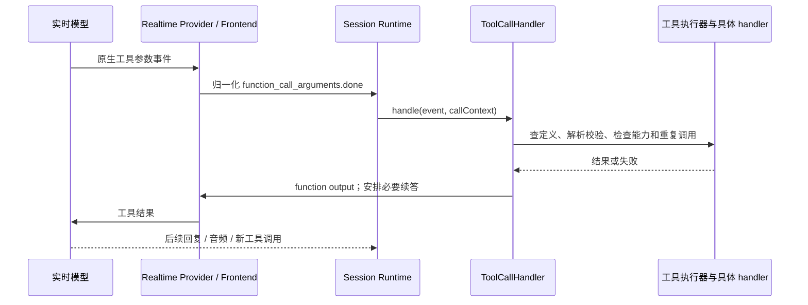

# 流程 A：从麦克风到模型工具，再到回复

[返回伴读入口](../README.md) · 后续：[Task 与结果投递](tasks-permissions-and-delivery.md)

## 1. 先分开两条连接

```text
客户端音频 / 文本 / 图片
  → Gateway Client Protocol 接入
  → 每条连接的前台会话运行时
  → Realtime Provider 的模型连接
  → 模型音频 / 转写 / 工具事件
  → 运行时处理与公开事件投影
  → 客户端展示、排队播放、回传播放事实
```

客户端到 Gateway、Gateway 到模型供应商是不同连接。它们的连接状态、认证、采样率和恢复机制分别维护。服务收到某个音频块，也不意味着该块已经被识别成完整文本。

本页主要以默认 WebSocket 客户端和 PCM 音频路径讲解。WebRTC 提供另一种媒体入口，不能把此处所有线上编码细节原样套用到它；共享的运行时语义见[客户端专题](../subsystems/clients-and-extensions.md)。

代码依据：[useRealtimeVoice](https://github.com/QwenAudio/qwen-audio-agent/blob/f6dd0e3703d58e4941159c1be89447f3fcb5063a/web/src/realtime/useRealtimeVoice.js#L203)、[GatewayClient](https://github.com/QwenAudio/qwen-audio-agent/blob/f6dd0e3703d58e4941159c1be89447f3fcb5063a/shared/gateway/client-sdk.mjs#L63)、[attachGatewayClientTransport](https://github.com/QwenAudio/qwen-audio-agent/blob/f6dd0e3703d58e4941159c1be89447f3fcb5063a/server/src/transport/gateway-client-transport.mjs#L62)、[createRealtimeSessionRuntime](https://github.com/QwenAudio/qwen-audio-agent/blob/f6dd0e3703d58e4941159c1be89447f3fcb5063a/server/src/voice/realtime-session-runtime.mjs#L56)、[RealtimeFrontend](https://github.com/QwenAudio/qwen-audio-agent/blob/f6dd0e3703d58e4941159c1be89447f3fcb5063a/server/src/voice/realtime-provider.mjs#L111)。

## 2. 客户端采集和协商

Web 客户端的音频采集相关代码在 `web/src/realtime/`。麦克风由 AudioWorklet 路径采样；重采样器跨分块保留处理状态。普通 WebSocket 音频路径会把 PCM 数据编码后放入协议事件发送，并控制发送缓存，防止慢连接无限积压。

先读 [createStreamingResampler](https://github.com/QwenAudio/qwen-audio-agent/blob/f6dd0e3703d58e4941159c1be89447f3fcb5063a/web/src/realtime/audio.js#L23) 和[麦克风采集](../../../web/src/realtime/microphone-capture.js)，再读 [useRealtimeVoice](https://github.com/QwenAudio/qwen-audio-agent/blob/f6dd0e3703d58e4941159c1be89447f3fcb5063a/web/src/realtime/useRealtimeVoice.js#L203) 的采集、连接和播放回调。输入与输出采样率由模型能力和握手信息参与决定；不要认定所有 Provider 都用同一个固定采样率。

GatewayClient 先建立 Socket，再发送 `session.hello`；收到 `session.ready` 才完成 GCP 握手。能力协商决定哪些输入、命令和回执可以使用。模型可用性另由实时连接状态表示。实现见 [GatewayClient](https://github.com/QwenAudio/qwen-audio-agent/blob/f6dd0e3703d58e4941159c1be89447f3fcb5063a/shared/gateway/client-sdk.mjs#L63) 与 [GATEWAY_CLIENT_PROTOCOL_VERSION / protocol definitions](https://github.com/QwenAudio/qwen-audio-agent/blob/f6dd0e3703d58e4941159c1be89447f3fcb5063a/shared/protocol/gateway-client-protocol.mjs#L13)。

## 3. Transport 把网络输入交给会话运行时

[attachGatewayClientTransport](https://github.com/QwenAudio/qwen-audio-agent/blob/f6dd0e3703d58e4941159c1be89447f3fcb5063a/server/src/transport/gateway-client-transport.mjs#L62) 接受已认证的 owner 和逻辑 session，创建前台 Session，处理连接归属及消息路由。`send`、任务事件投影、响应完成观察等以回调形式注入。

[createFrontendRuntime](https://github.com/QwenAudio/qwen-audio-agent/blob/f6dd0e3703d58e4941159c1be89447f3fcb5063a/server/src/app/frontend-runtime.mjs#L12) 持有共享依赖，工具来源只初始化一次；每次 `createSession()` 调用 [createRealtimeSessionRuntime](https://github.com/QwenAudio/qwen-audio-agent/blob/f6dd0e3703d58e4941159c1be89447f3fcb5063a/server/src/voice/realtime-session-runtime.mjs#L56)。这个拆分使 Session 不必知道 Socket 或设备 Token，Transport 也不必装配搜索、知识库和模型工具。

每条连接有自己的音频轮次、响应管理、工具调用及 SessionTaskCoordinator。应用的 Task 状态则由共享 TaskManager 持有；连接级状态和工作级状态不能互相覆盖。

## 4. Provider 的职责是转换，不是替业务作决定

[RealtimeFrontend](https://github.com/QwenAudio/qwen-audio-agent/blob/f6dd0e3703d58e4941159c1be89447f3fcb5063a/server/src/voice/realtime-provider.mjs#L111) 封装模型会话操作；[RealtimeProviderRegistry](https://github.com/QwenAudio/qwen-audio-agent/blob/f6dd0e3703d58e4941159c1be89447f3fcb5063a/server/src/voice/providers/provider-registry.mjs#L261) 校验和登记具体 Provider。`voice/providers/` 中的实现负责端点、认证、Session 配置、模型能力、事件转换及协议方法。

模型供应商的原生转写、音频和工具事件经过适配进入通用运行时。前台模型是否直接回答、调用搜索工具还是提交 `spawn_thinking`，取决于当前上下文、指令、可用工具与模型行为；不是 TaskManager 对每句 ASR 进行固定关键词分类。

Python 理解锚点：Provider 类似外部客户端适配层；RealtimeFrontend 类似统一客户端门面；会话运行时类似拥有业务状态和回调的一次长连接服务实例。

## 5. 一次工具调用的真实入口



依据：[handleEvent: function_call_arguments.done](https://github.com/QwenAudio/qwen-audio-agent/blob/f6dd0e3703d58e4941159c1be89447f3fcb5063a/server/src/voice/realtime-session-runtime.mjs#L575) → [ToolCallHandler.handle](https://github.com/QwenAudio/qwen-audio-agent/blob/f6dd0e3703d58e4941159c1be89447f3fcb5063a/server/src/frontend/tools/tool-call-handler.mjs#L481) → [FrontendToolRegistry](https://github.com/QwenAudio/qwen-audio-agent/blob/f6dd0e3703d58e4941159c1be89447f3fcb5063a/server/src/frontend/tools/frontend-tool-registry.mjs#L107)、[FrontendToolExecutor](https://github.com/QwenAudio/qwen-audio-agent/blob/f6dd0e3703d58e4941159c1be89447f3fcb5063a/server/src/frontend/tools/frontend-tool-registry.mjs#L166) → [ToolCallHandler.sendOutput](https://github.com/QwenAudio/qwen-audio-agent/blob/f6dd0e3703d58e4941159c1be89447f3fcb5063a/server/src/frontend/tools/tool-call-handler.mjs#L266)。实现包含回复占用、延迟工具结果与重复调用处理，因此图表示语义路径，不代表每条操作都同步依次完成。

工具有三件不同的事：**定义 schema** 让模型知道怎样调用；**可用性** 决定当前会话是否提供；**handler** 执行真实动作并校验。仅在 Prompt 中写一个工具名，不会创建实际能力。

核心工具、可选功能与动态工具都要通过实际能力约束。未配置后台时不应提供可执行的后台委派能力；权限回复工具只在有真实请求时出现。定义与装配见 [frontendTools](https://github.com/QwenAudio/qwen-audio-agent/blob/f6dd0e3703d58e4941159c1be89447f3fcb5063a/server/src/frontend/frontend-tools.mjs#L109)、[optionalFrontendFeatures](https://github.com/QwenAudio/qwen-audio-agent/blob/f6dd0e3703d58e4941159c1be89447f3fcb5063a/server/src/frontend/optional-features.mjs#L6)、[前台 MCP](../../../server/src/frontend/tools/mcp/frontend-mcp-client.mjs)。

`ToolCallHandler` 的输入包含 callId、turnId、responseId 和轮次 generation。这些信息用于判断关联和过期，不是供最终用户背诵的业务字段。

## 6. 工具执行分成哪些情况

| 情况 | 例子 | 生命周期 |
| --- | --- | --- |
| 即时读取或简单操作 | 时间、Task 状态、清单 | handler 返回结果，模型据此回答 |
| 前台外部工具 | 网页读取、知识检索、MCP / OpenAPI | 有真实 I/O 和失败处理；通常不创建后台办事 Task |
| 后台受理 | `spawn_thinking` | 先创建 Task、给模型受理回执，工作以后完成 |
| 已有工作的控制 | 取消、权限回复、补充输入 | 针对真实 task/request；不能自动创建另一项工作 |

这个表是阅读分类，不是运行时必须声明的工具 mode。当前注册表没有要求所有工具填写“核心 / 可选”或“同步 / 异步”分类元数据。工具循环、结果大小与重复调用策略看实际 policy 和 handler。

**前台外部工具也可能需要等待 I/O。** 非阻塞后台设计的保证是受理路径不等待整个后台工作完成，而不是整个语音系统永远没有任何等待。即使 `spawn_thinking` 内也有发送工具结果的异步操作；空 objective 的少见纠错路径还会等待转写解析。依据 [AgentTaskRuntime.executeSpawnThinkingToolCall](https://github.com/QwenAudio/qwen-audio-agent/blob/f6dd0e3703d58e4941159c1be89447f3fcb5063a/server/src/frontend/tools/agent-task-runtime.mjs#L195)。

## 7. 音频生成完成与播放事实

普通音频回复生成结束时，服务端看到 `response.done`。客户端可能仍有已排队音频，也可能尚未开始播放。浏览器 Web Audio 按自己的时钟安排播放；客户端确认实际开始后，回传 `playback.started`。

代码看 [confirmTrackedPlaybackStart](https://github.com/QwenAudio/qwen-audio-agent/blob/f6dd0e3703d58e4941159c1be89447f3fcb5063a/web/src/realtime/playback-lifecycle.js#L10)、[useRealtimeVoice](https://github.com/QwenAudio/qwen-audio-agent/blob/f6dd0e3703d58e4941159c1be89447f3fcb5063a/web/src/realtime/useRealtimeVoice.js#L203)，服务端看 [AnnouncementManager](https://github.com/QwenAudio/qwen-audio-agent/blob/f6dd0e3703d58e4941159c1be89447f3fcb5063a/server/src/voice/announcement/announcement-manager.mjs#L66) 与 [AnnouncementWindow](https://github.com/QwenAudio/qwen-audio-agent/blob/f6dd0e3703d58e4941159c1be89447f3fcb5063a/server/src/voice/announcement/announcement-window.mjs#L1)。后台结果是否已交付不能仅由模型 `response.done` 决定。完整解释见[流程 B 的投递部分](tasks-permissions-and-delivery.md)。

用户打断当前音频会影响 response / 播放状态，但不会默认调用 TaskOperations.cancel。静音、休眠、断连也要看各自的生命周期入口。

## 8. 失败与过期回调怎么读

- 模型认证、额度或端点失败属于模型连接错误；Gateway 监听成功不代表它们成功。
- 工具不可用、参数错误、外部服务超时属于工具结果分支；不能直接把它们当成已完成的后台 Task。
- 同一调用或同一轮次的重复操作受到 handler / loop / submissionKey 等不同层级的约束；这些不是一把全局去重锁。
- Session 关闭和轮次变化后，迟到回调不能再受理新工作或污染新回复；看 `closed`、generation 和 `shouldDeliver` 等条件。
- 连接恢复与 response 冲突有各自有界处理，不能把所有异常统一解释为“自动重试到成功”。

定位：[ToolCallHandler.handle](https://github.com/QwenAudio/qwen-audio-agent/blob/f6dd0e3703d58e4941159c1be89447f3fcb5063a/server/src/frontend/tools/tool-call-handler.mjs#L481)、[AgentTaskRuntime.executeSpawnThinkingToolCall](https://github.com/QwenAudio/qwen-audio-agent/blob/f6dd0e3703d58e4941159c1be89447f3fcb5063a/server/src/frontend/tools/agent-task-runtime.mjs#L195)、[createRealtimeSessionRuntime](https://github.com/QwenAudio/qwen-audio-agent/blob/f6dd0e3703d58e4941159c1be89447f3fcb5063a/server/src/voice/realtime-session-runtime.mjs#L56)、[响应占用](../../../server/src/voice/realtime-response-slot.mjs)、[恢复上下文](../../../server/src/voice/realtime-recovery-context.mjs)。真实服务行为仍取决于 Provider 和外部系统。

## 9. 测试与阅读练习

本次已运行 `announcement-window.test.mjs` 与相关依赖边界测试。`realtime-session-runtime.test.mjs`、`realtime-provider-behavior.test.mjs` 和 `frontend-tool-registry.test.mjs` 是继续阅读的代表用例，本次没有执行它们，不应据此声称所有 Provider 已实测。

练习：沿 `response.function_call_arguments.done` 找到 `spawn_thinking` 的 handler，再找工具结果回送模型的方法。沿路标出哪些函数只转发，哪些真正校验或改变状态。此时不需要读完 `useRealtimeVoice.js` 的全部 UI 状态。
