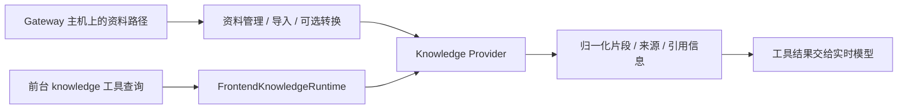

# 专题：记忆、知识与上下文

[返回伴读入口](../README.md) · 关联：[状态与持久化](../data/state-and-persistence.md)

## 1. 不同材料不能都叫“记忆”

| 材料 | 表达什么 | 谁拥有 / 维护 | 对模型行为的作用 |
| --- | --- | --- | --- |
| `config/frontend-agent/PROMPT.md` | 核心对话与任务规则 | 随包规则与前台指令装配 | 不能被个性化覆盖 |
| 本地 `ASSISTANT.md` | 助手实例的默认身份、关系与表达风格 | 配置文件 | 默认画像，用户偏好和当前请求可以覆盖适用部分 |
| `USER.md` | 用户明确的长期偏好 | Memory 模块 / Provider | 经边界处理的长期交互要求 |
| `MEMORY.md` | 持久事实和决定 | Memory 模块 / Provider | 帮助理解与回答，不授予操作权限 |
| 命名清单 | 购物、待办等条目集合 | FrontendNotesStore | 条目数据，不应自动变成长期偏好 |
| 近期对话 / 会话摘要 | 聊过什么、任务如何呈现 | conversation / session | 支持上下文连续性与回顾 |
| 知识库 | 文档、资料和检索片段 | Knowledge Provider / Library | 回答资料问题，外部内容不变成执行指令 |
| Task 记录 | 工作状态、产物、授权和通知事实 | TaskManager | 工作权威，不能由聊天摘要替代 |

依据：[buildMemoryContext](https://github.com/QwenAudio/qwen-audio-agent/blob/f6dd0e3703d58e4941159c1be89447f3fcb5063a/server/src/memory/context.mjs#L60)、[assertMemoryProvider / provider contract](https://github.com/QwenAudio/qwen-audio-agent/blob/f6dd0e3703d58e4941159c1be89447f3fcb5063a/server/src/memory/provider.mjs#L76)、[FrontendNotesStore](https://github.com/QwenAudio/qwen-audio-agent/blob/f6dd0e3703d58e4941159c1be89447f3fcb5063a/server/src/conversation/frontend-notes.mjs#L85)、[buildFrontendContext](https://github.com/QwenAudio/qwen-audio-agent/blob/f6dd0e3703d58e4941159c1be89447f3fcb5063a/server/src/conversation/frontend-agent-context.mjs#L120)、[assertKnowledgeRetrievalProvider](https://github.com/QwenAudio/qwen-audio-agent/blob/f6dd0e3703d58e4941159c1be89447f3fcb5063a/server/src/knowledge/provider.mjs#L156)、[TaskStatus / TRANSITIONS](https://github.com/QwenAudio/qwen-audio-agent/blob/f6dd0e3703d58e4941159c1be89447f3fcb5063a/server/src/task/task-state.mjs#L5)。具体路径见[持久化章节](../data/state-and-persistence.md)，用户设置方式见[个性化手册](../../reference/personalization.zh.md)。

## 2. Memory 的最小接口和实时约束

[assertMemoryProvider / provider contract](https://github.com/QwenAudio/qwen-audio-agent/blob/f6dd0e3703d58e4941159c1be89447f3fcb5063a/server/src/memory/provider.mjs#L76) 的必需方法为 `describe()`、同步 `list(ownerId, options)` 和 `apply(ownerId, changes, context)`。`list()` 用来提供低延迟模型上下文；异步远程存储应维护有界本地快照，不能把每次 Prompt 组装变成未受控网络等待。

[FrontendMemoryRuntime](https://github.com/QwenAudio/qwen-audio-agent/blob/f6dd0e3703d58e4941159c1be89447f3fcb5063a/server/src/memory/runtime.mjs#L53) 对返回文档归一化，维护变更订阅和 owner 写入通道。后续同一用户写入要有顺序；一个失败不能永久堵住后续写入。具体 Markdown Provider 在[provider](../../../server/src/memory/providers/markdown/provider.mjs)和[context-store](../../../server/src/memory/providers/markdown/context-store.mjs)。

协议 v2 通过 capabilities 声明可选 `query/observe/flush/observeAudio`。并非某个方法名字存在就应自动启用能力；描述与方法要匹配。

`observeAudio` 位于已接收 PCM 的热路径，契约要求同步、有界、无远程 I/O。如果接入 Python 语音记忆服务，应在 Adapter 中有界缓存后异步处理，不能对每个音频块同步等待 HTTP。

Provider 若拥有 sessionObservation，取代内置提取和偏好学习链路；不是两套学习器并行写同一份记忆。装配依据 [createMemoryModule](https://github.com/QwenAudio/qwen-audio-agent/blob/f6dd0e3703d58e4941159c1be89447f3fcb5063a/server/src/memory/module.mjs#L10)。

## 3. 显式写入与会话后学习

`memory` 工具执行 `read / append / replace` 原子操作。`replace` 用唯一原文匹配定位；没有匹配或有歧义时失败，不能随意替换同名概念。`user` 与 `memory` 的区分基于行为权威，不是简单按人物 / 工作主题分组。

会话结束观察器可以触发自动提取；内置提取器把明确长期要求和稳定事实分别写到合适文档。它使用统一记忆服务，不应绕过服务直接改文件，也不能修改助手默认画像。

可选偏好学习另有候选、跨会话观察和提升逻辑，默认关闭。运行中的自动文本分析是否可用取决于配置和文本模型调用依赖；“有这个目录”不证明你的部署正在运行所有学习能力。

定位：[memoryToolHandlers](https://github.com/QwenAudio/qwen-audio-agent/blob/f6dd0e3703d58e4941159c1be89447f3fcb5063a/server/src/memory/tools.mjs#L186)、[MemoryExtractor](https://github.com/QwenAudio/qwen-audio-agent/blob/f6dd0e3703d58e4941159c1be89447f3fcb5063a/server/src/memory/learning/extractor.mjs#L202)、[createMemoryModule](https://github.com/QwenAudio/qwen-audio-agent/blob/f6dd0e3703d58e4941159c1be89447f3fcb5063a/server/src/memory/module.mjs#L10)、[偏好学习说明](../../reference/preference-learning.zh.md)。本次以源码核对这部分，没有请求真实文本模型进行提取。

## 4. Knowledge 的两条流程：入库与检索

依据：[createKnowledgeModule](https://github.com/QwenAudio/qwen-audio-agent/blob/f6dd0e3703d58e4941159c1be89447f3fcb5063a/server/src/knowledge/module.mjs#L9)、[KnowledgeLibraryService](https://github.com/QwenAudio/qwen-audio-agent/blob/f6dd0e3703d58e4941159c1be89447f3fcb5063a/server/src/knowledge/library-service.mjs#L20)、[FrontendKnowledgeRuntime](https://github.com/QwenAudio/qwen-audio-agent/blob/f6dd0e3703d58e4941159c1be89447f3fcb5063a/server/src/knowledge/runtime.mjs#L25)、[LocalKnowledgeProvider](https://github.com/QwenAudio/qwen-audio-agent/blob/f6dd0e3703d58e4941159c1be89447f3fcb5063a/server/src/knowledge/providers/local/provider.mjs#L104)。入库和检索有不同生命周期。需要文档转换时，可以使用隔离的后台工具性工作；普通知识检索并不等于新建一个用户办事 Task。

[assertKnowledgeRetrievalProvider](https://github.com/QwenAudio/qwen-audio-agent/blob/f6dd0e3703d58e4941159c1be89447f3fcb5063a/server/src/knowledge/provider.mjs#L156) 最小要求 `describe()` 和 `retrieve(request, context)`。可选 `ingest/list/remove` 共同支持管理能力；外部 Provider 的 job、图对象和原始响应留在 Provider 内。`FrontendKnowledgeRuntime.search()` 验证可信 owner、限制 topK、处理取消和超时，再归一化结果。

内置 [LocalKnowledgeProvider](https://github.com/QwenAudio/qwen-audio-agent/blob/f6dd0e3703d58e4941159c1be89447f3fcb5063a/server/src/knowledge/providers/local/provider.mjs#L104) 从文本与 Markdown 标题分块，对查询词、片段与文档元数据匹配评分，返回实际片段。这是一种轻量确定性检索；不能把“支持知识库”直接写成“内置向量数据库或知识图谱”。

要使用向量、图或外部企业知识服务，可替换 Provider。[LightRAG 示例](../../../examples/lightrag/README_ZH.md)是最适合 Python 使用者的跨语言入口：LightRAG 服务独立安装与管理，Node Provider 负责 HTTP 和契约归一化，Gateway 仍用正常的 `createGatewayApplication`。

内置本机资料管理的路径指 Gateway 主机可访问的文件。手机或远程浏览器上的本地路径，不会自动变成 Gateway 的本机文件路径；要看场景提供的上传或导入方式。

## 5. 上下文送给谁，也是一条边界

前台上下文由核心规则、默认画像、用户偏好、事实记忆、对话及当前可用能力组合。并不是把每个存储文件原样拼给所有模型。

通用 `spawn_thinking` 需要传递自包含 objective；后台不自动得到前台所有上下文。ACP 内部有自己的持久执行 Session；A2A 示例也可以维护外部上下文。它们与前台恢复对话并不是同一份存储。

客服示例额外把最近对话用于任务交接，并要求前台把必要已核实编号、查询结果写入 objective；这是场景自己的适配。要确认行为，应读[客服 README](../../../examples/customer-service/README_ZH.md)和 Gateway / backend wiring，而不能推断所有 BackendPort 都这样。

通用定位：[spawnThinkingTool](https://github.com/QwenAudio/qwen-audio-agent/blob/f6dd0e3703d58e4941159c1be89447f3fcb5063a/server/src/frontend/tools/spawn-thinking-tool.mjs#L3)、[BackendWorkRuntime](https://github.com/QwenAudio/qwen-audio-agent/blob/f6dd0e3703d58e4941159c1be89447f3fcb5063a/server/src/backend/backend-work-runtime.mjs#L14)、[buildFrontendContext](https://github.com/QwenAudio/qwen-audio-agent/blob/f6dd0e3703d58e4941159c1be89447f3fcb5063a/server/src/conversation/frontend-agent-context.mjs#L120)。

## 6. 可选模块为什么有两处装配

[optionalModuleFactories](https://github.com/QwenAudio/qwen-audio-agent/blob/f6dd0e3703d58e4941159c1be89447f3fcb5063a/server/src/app/optional-modules.mjs#L6) 登记应用级领域服务、路由、观察器和关闭；[optionalFrontendFeatures](https://github.com/QwenAudio/qwen-audio-agent/blob/f6dd0e3703d58e4941159c1be89447f3fcb5063a/server/src/frontend/optional-features.mjs#L6) 登记前台工具、可用性及指令 / 上下文贡献。

这是显式构建装配，不是扫描磁盘自动加载的插件发现协议。若制作裁剪发行版，移除领域必须同时处理这两处和相关 exports / 依赖 / 测试。换 Provider 通常只需要在应用工厂注入实现，不必删除整个领域。

本次运行了 `dependency-boundaries.test.mjs`，确认当前源码依赖方向。`optional-modules-pruning.test.mjs` 是物理裁剪的代表验证，本次没有执行，阅读练习也不要求实际删目录。

**读完检查：**你应该能解释：为什么 Memory 的 list 必须同步，Knowledge 的 retrieve 可以异步；为什么学习偏好、保存清单、查知识库和查询 Task 状态应到四条不同路径查找。
