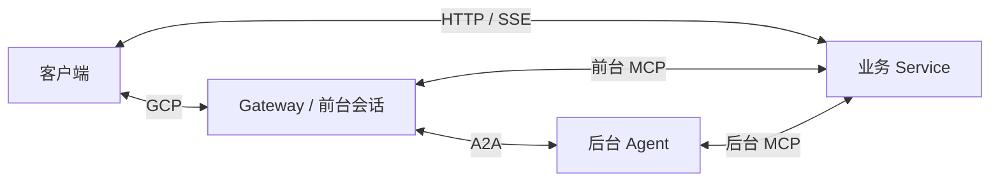

# 智能座舱思想学习：精简伪代码

先打开 [overview.py](overview.py)。这一份串起四个进程和三条请求路径，
不用先遍历整个目录。目标是读懂职责与数据流，不要求运行或移植项目。

## 怎么读

- 写法借鉴 Python；中文函数如“后台异步执行”表示一个抽象步骤，没有实现。
- 不用寻找这些中文函数对应的库。想展开细节时，再看原源码。
- 每个文件只回答一个核心问题，注释解释步骤、目的和哪些部分被省略。
- 工厂、React hook 有时改写为类，参数也会归纳。名字不代表真实 Python SDK。
- 顺序写法方便阅读；真实模型、网络、任务之间还有异步事件和回调。

## 先记住四个角色

| 角色 | 负责什么 |
|---|---|
| client | 收音、播放、展示与用户操作 |
| gateway | 组装框架运行时，接入客户端，管理前台会话、工具调用与任务 |
| agent | 使用自己的模型和工具执行后台工作 |
| service | 保存座舱业务状态，执行车控、导航、音乐等操作 |

前台会话另接实时模型，后台 Agent 另接 Chat 模型。
车辆等业务状态在 Service，任务状态在 Gateway，分别管理。

## 阅读路线

**5 分钟：** [单文件总览](overview.py)，理解四个角色与三条路径。

**30 分钟：**

1. [gateway/server.py](gateway/server.py)：座舱传给框架什么？
2. [gateway_application.py](framework_reference/gateway_application.py)：框架把谁接给谁？
3. [frontend_session.py](framework_reference/frontend_session.py)：前台请求如何分叉？
4. [task_runtime.py](framework_reference/task_runtime.py)：后台工作如何排队、回到对话？
5. [agent/executor.py](agent/executor.py)：后台模型如何使用工具？
6. [cockpit_service.py](service/cockpit_service.py)：工具实际在哪里改变业务？

**按需深入：** [请求路径说明](docs/execution_flows.md) →
[源码对照](docs/source_map.md) → 原 JavaScript。
记忆、技能、环境事件、地图接入和评估目录用于后续查阅，不必第一遍全读。

## 目录与资料

client/gateway/agent/service/bootstrap/bench 对应原座舱各模块；
framework_reference 额外展开框架内部思想，原项目没有复制这些框架代码。

六组工具清单、路由 JSON、三个人设 Markdown 保留原定义，方便查阅。
默认业务工具前台 37 个、后台 1 个；后台另按配置组合网页检索工具。

- [框架能力与接口](docs/framework_api.md)
- [Python 接入边界](docs/python_interop.md)，实际迁移时再读
- [源码对照表](docs/source_map.md)

## 依据与范围

本地源码提交：c24ed491ceed16ed7191f30bb14f2cee81fe3361；分析日期：2026-10-06。
源码符号、相对链接和伪代码语法经过检查；没有启动真实模型或重跑系统评估。
协议编码、音频处理、认证、调度、恢复、通知重试、完整工具业务等概括为伪操作。
精简版省略的约束可回到原源码核对，不作为实现参考。原项目代码保持原样。
