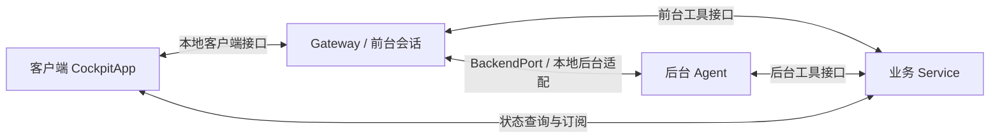

# 智能座舱 Python 学习版

这是可以直接运行的 Python 项目。所有业务调用都有实现，模块之间用真实 `import` 连接，可以在 IDE 中跳转。
它复现原智能座舱的职责划分和核心执行链，方便先用 Python 理解思想，再回到 JavaScript 源码。

## 直接运行

需要 Python 3.10 或以上；默认只用标准库，不需要安装依赖、API Key 或启动原服务。

```bash
cd /Users/zst/Desktop/qwen-audio-agent/examples/smart-cockpit-python-study
python3 main.py --demo
python3 main.py --demo --trace
python3 main.py --interactive
python3 main.py --benchmark
python3 -m unittest discover -s tests -v
```

`main.py` 是程序入口，默认运行 `overview.run_demo()`。
演示会执行：聊天 → 空调与音乐工具 → 咖啡后台任务 → 继续聊天 → 结果回到会话 → 确认演示订单 → 温度提醒。
`--trace` 输出组件的实际调用记录。`--interactive` 接受同类文字输入；离线规则模型只识别代码中列出的有限表达。

## 在 IDE 中阅读

用 VS Code 打开本目录的 [smart-cockpit-study.code-workspace](smart-cockpit-study.code-workspace)，或将本目录单独作为项目根目录。
选择 Python 3.10+ 解释器，并启用编辑器的 Python 语言支持，即可跳转到导入的函数、类和方法。
PyCharm 同样可以直接打开本目录；若从整个仓库打开，将本目录标记为 Sources Root。
本目录中的 `.vscode/settings.json` 和 `pyrightconfig.json` 配置了学习代码的导入路径。

第一遍按以下顺序读，先不要遍历全部业务工具：

1. [main.py](main.py)：程序如何启动。
2. [overview.py](overview.py) 的 `run_demo()`：用户请求和返回结果。
3. [bootstrap/start.py](bootstrap/start.py) 的 `build_study_runtime()`：创建对象，把谁传给谁。
4. [gateway/server.py](gateway/server.py) → [gateway_application.py](framework_reference/gateway_application.py)：业务宿主如何装配 Gateway，共享服务和每个连接的会话如何区分。
5. [frontend_session.py](framework_reference/frontend_session.py)：聊天、前台工具、`spawn_thinking` 三条分支。
6. [task_runtime.py](framework_reference/task_runtime.py) → [agent/executor.py](agent/executor.py)：任务如何排队、执行模型/工具循环，并把结果送回会话。
7. [cockpit_service.py](service/cockpit_service.py) → [registry.py](service/tools/registry.py) → [vehicle/execute.py](service/tools/vehicle/execute.py)：工具在哪里真正改变业务状态。

## 四个角色与数据归属

| 目录 | 负责什么 | 持有的数据 |
|---|---|---|
| `client/` | 发送输入，接收回复，订阅状态，报告模拟播放完成 | UI 状态副本、消息列表、环境事件队列 |
| `gateway/` + `framework_reference/` | 装配应用，创建前台会话，执行前台工具，管理后台任务与通知 | 任务记录、每连接会话、记忆 |
| `agent/` | 后台模型选择工具，工具结果再交给模型，最后返回结果 | 后台对话历史、正在执行的协程 |
| `service/` | 实现车控、导航、音乐、天气、闪购、自定义技能 | 业务权威状态、技能定义、温度规则 |

Gateway 是运行时的服务化装配入口；前台会话由 Gateway 为客户端连接创建。
客户端负责输入与呈现，`RealtimeSessionRuntime` 中的模型、上下文和工具处理器承担前台 Agent 的职责。
Service 是座舱业务服务，不是框架自带的车辆服务。



原项目这些边界分别使用 GCP/WebSocket、A2A、MCP、HTTP/SSE；本学习版用同一进程中的方法调用与订阅实现边界。
`bootstrap` 将四组对象接起来，没有启动四个操作系统进程。
`framework_reference` 是为学习新增的 Python 实现，用来展开框架内部职责；不是原项目发布的 Python SDK。

## 哪些已经实现

- 六个工具域共 38 个工具名与清单；前台 37 个，后台 1 个 `flashbuy`。后台另组合 `web_search` 与 `fetch_url`。
- 静态工具注册、基本参数校验、真实业务状态更新和客户端状态同步。
- 用 `asyncio` 执行后台任务，同一用户排队；提交立即返回回执，不阻塞前台聊天。
- 任务完成、失败、取消；结果等待会话可用，发送后还需播放回执才能标记 `delivered`。
- 咖啡搜索、加购、预览和确认的本地演示流程；预览不会自动生成订单。
- 工作流保存、加载与使用已有工具执行；温度事件从条件外进入条件内才提醒，创建规则不会立即提醒。
- 人设切换、导航偏好上下文、环境事件队列、记忆增删与版本冲突。
- 按需将技能保存到文件；默认所有状态都在内存，关闭后清空。
- 四个实际调用的学习评估用例，以及回归测试。

## 外部能力的简化

前台 `DemoRealtimeModel` 和后台 `DemoChatModel` 是离线规则模型，不调用真实大模型。
地图、天气、曲库、网页和商品来自明确标记的演示数据；控制空调只改变模拟状态，不连接车辆。
客户端用文字输出和播放回执模拟语音交互，没有麦克风、扬声器或 React/3D 页面。
`send_audio()` 只把 UTF-8 文本字节送入相同链路，不能处理 PCM 或识别真实语音。

网络协议编码、认证握手、音频流、磁盘任务恢复、断线重连、生产级调度和投递重试未实现。
参数校验覆盖必填、基本类型、枚举与部分业务规则，未实现完整 JSON Schema 校验。
`ChatModel`、`BackendPort` 中的 `Protocol` 是 Python 类型接口；运行时使用具体实现类，不是待补齐的伪操作。
可选 `DashScopeCockpitModel` 支持注入兼容客户端，但本次验证的是默认离线学习版。

## 继续查阅

- [调用链与断点路线](docs/execution_flows.md)：每个箭头对应哪个真实方法。
- [源码对照表](docs/source_map.md)：学习符号、行号和原项目符号。
- [框架能力目录](docs/framework_api.md)：原框架的公开装配 API、网络接口和扩展契约。
- [Python 实际迁移边界](docs/python_interop.md)：学习版与保留原框架迁移业务代码的区别。

原源码核对基于提交 6bb306bb56530be481e4cbef85bb67b0502088ae，日期 2026-10-06。
本次只修改学习目录；六组工具清单、工具路由与三个人设文件仍保留原定义。
