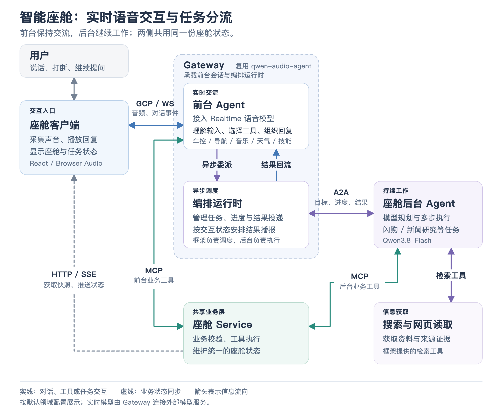

# 00 · 项目全貌与框架基础

想象一个驾驶场景：你说“先把空调调低一点，导航去公司”，屏幕上的温度和路线随之变化。途中又说“帮我找些今天的汽车新闻”，助手开始查资料，但仍能回应你的其他问题。这就是 smart-cockpit 的主要工作：**把实时语音交流、座舱业务操作、后台办事和界面反馈组合成一个连续的使用体验。**

## 先看项目做了哪些事

日常操作包括车控、导航、音乐和天气；长任务包括闪购流程、新闻简报或资料研究。用户还可以保存自己的工作流口令、温度提醒和长期偏好，切换助手的人设与音色。界面会显示车辆、地图、音乐、订单和任务进度。

这些功能的实现程度有所不同。车控修改的是演示车辆状态，音乐使用示例曲库和媒体状态，闪购使用固定商品目录与模拟订单。导航和天气具备调用真实高德服务的实现，新闻研究会通过检索工具获取网页资料，语音和后台推理接入真实模型服务。完整方案已经把这些能力接成闭环，真实车辆、商业音乐平台和配送交易系统仍需要后续业务集成。

## qwen-audio-agent 为什么是基础

qwen-audio-agent 提供的是可复用的实时语音 Agent 运行框架。它解决“怎样持续交流，同时执行工作”的通用问题；smart-cockpit 提供车辆、路线和订单等场景语义与执行环境。

框架的三个主要逻辑角色是：**前台 Agent** 理解输入、选择工具和组织回复；**编排运行时** 用程序管理任务、会话、进度、权限和结果投递；**后台 Agent** 在自己的执行环境里完成工作。编排运行时本身是一组确定性的调度与状态管理代码，不需要再用一个模型当“总指挥”。

它们围绕几类可替换的能力协作：

| 框架能力 | 底层怎样实现 | 座舱怎样使用 |
|---|---|---|
| 实时模型接入 | Realtime Provider 适配模型连接、音频与事件格式 | 默认接入 Qwen Audio 3.0 Realtime Plus |
| 客户端接入 | GCP 消息契约与客户端 SDK，默认通过 WebSocket 通信 | React 界面采音、播放、展示任务 |
| 前台工具 | 工具注册、Function Calling、MCP/OpenAPI 接入及执行边界 | 直接调用车控、导航、音乐、天气和技能工具 |
| 任务编排 | 任务记录、事件、取消、结果投递与播放回执 | 后台工作期间保持实时对话 |
| 后台适配 | 统一后台接口，协议差异留在 A2A、ACP 等 Adapter 中 | 接入座舱自己的 A2A Agent |
| 记忆与个人工具 | 默认 Markdown 记忆、清单与提醒等能力 | 保存用户偏好与长期事实 |
| 可选知识与检索 | Knowledge Provider 与网页检索组件 | 后台复用检索；知识库可以按需接入 |

“支持知识库”表示框架提供接入能力。当前座舱 Gateway 没有显式装配专用 Knowledge Provider，也没有因此形成一套座舱 RAG 系统。

## 四个进程各自负责什么

[放大查看架构图](assets/voice_and_task_routing.png)

客户端负责交互与显示；Gateway 装配框架并连接实时模型；后台 Agent 负责需要持续执行的目标；Service 提供场景工具、状态与外部服务适配。前台和后台都调用同一个 Service，界面也从这里读取业务状态。

“三个逻辑角色”与“四个进程”是两个视角。前台 Agent 与编排运行时由 Gateway 承载，客户端与 Service 则分别承担交互和业务基础设施。这样理解，就不会把浏览器界面当成前台模型，也不会把 Service 当成第三个智能决策 Agent。

## 一次请求，按职责分配工作

用户说“导航去公司”，客户端把输入发给 Gateway，实时模型理解后选择导航工具。Service 解析地点、规划路线、保存结果，再把状态推给地图界面，模型依据工具结果回答。

用户说“整理今天的汽车新闻”，前台把目标交给任务运行时，运行时连接后台 Agent。后台模型反复使用搜索和网页读取工具形成报告，最终把完整报告与简短摘要交回来，框架安排结果进入当前对话。这两条路径共用交互入口，但执行方式由实际能力归属决定。

这套架构便于扩展：接真实车辆通常改 Service 的设备适配；换语音模型通常改 Provider 配置或适配；换后台通常改后台接入；换车机界面则使用客户端协议。业务工具的执行逻辑不用随着每一种模型或界面复制一遍。

## 面试时怎样概括

可以先说：“这是基于 qwen-audio-agent 的智能座舱示例。我把它理解为四个协作部分：交互客户端、语音与任务 Gateway、后台 Agent、业务 Service。实时模型处理交流与工具选择，后台模型处理持续工作，业务状态由 Service 统一维护。”随后沿一个具体场景展开，就能把技术关系讲清楚。

事实对照

框架职责见 [架构总览](../../../../docs/architecture/overview.zh.md) 与 [Gateway 应用装配](../../../../server/src/app/gateway-application.mjs#L63)。座舱边界见 [architecture.md](../architecture.md)、[Gateway 装配](../../gateway/server.mjs) 和 [Service 装配](../../service/server.mjs)。可替换记忆与知识能力见 [Memory Provider](../../../../docs/reference/memory-provider.zh.md) 和 [Knowledge Provider](../../../../docs/reference/knowledge.zh.md)。

代表性验证包括 [公开 API 装配测试](../../gateway/test/composition.test.mjs) 和 [工具执行面测试](../../test/tool-surfaces.test.mjs)。

[返回目录](README.md) · [下一篇：前台语音交互与任务分流](01_voice_and_task_routing.md)
