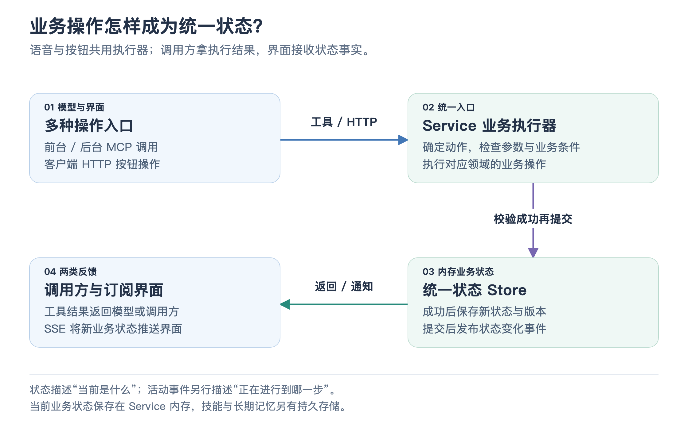

# 02 · 业务 Service 与统一状态

你先说“空调调到 24 度”，再点屏幕上的 `−` 按钮，温度变成 23 度。随后问“现在是多少度”，助手应回答同一个数值。这个场景要求：**语音、按钮和界面展示围绕同一份业务状态工作。** 这正是座舱 Service 的职责。

## 它为什么单独存在

模型需要知道业务执行结果，界面需要知道车辆和路线的真实状态，后台也需要继续处理已有购物车。Service 为这些使用者提供统一的工具执行与状态来源。Gateway 管理对话和任务，Service 管理车辆、导航、音乐、天气与闪购等业务对象。

[放大查看流程图](assets/service_state_flow.png)

语音请求通过 MCP 进入 Service，界面按钮通过 HTTP 命令进入 Service；两者最终使用同一套业务执行器。HTTP 与 MCP 负责接入方式，具体业务条件由执行器判断。

## “调温度”如何提交一次修改

Service 根据工具名找到温控执行器。执行器判断设置温度还是增减温度、作用于哪个区域，再检查数值范围。模型提供的参数只是一项请求，程序仍要验证它能否执行。

状态 Store 按车机 ID 保存一份状态记录。更新时先复制当前记录，在副本上修改；修改成功后增加版本号、记录更新时间，再保存为新的状态并通知观察者。这样调用方读到的是快照，业务修改集中发生在受控入口，不会靠直接改一个返回对象来悄悄修改内部状态。

这里的版本号主要描述状态的新旧，并随更新事件一起发送。Store 是 Service 进程内的内存状态管理；车辆、路线、音乐等运行状态没有因此自动变成数据库中的持久事务，也不能把版本号理解成已经完成分布式并发控制。

## 操作结果与状态事件分别服务谁

执行器会把简短文本、结构化数据、变更领域和状态版本返回调用方。前台模型可以据此说“温度已调好”，后台模型可以据此选择下一步。

状态变化则经 SSE 推送给界面。**SSE 是服务器到浏览器的单向事件流**：客户端先用 HTTP 或连接后的快照获得当前状态，再持续接收变化。事件包含哪些领域变化了，界面据此更新相应面板。

另有一类“活动事件”，用来描述正在查地点、规划路线、搜索商品等过程。活动告诉用户“工作进行到哪一步”，状态告诉用户“当前业务结果是什么”。查找中的动画不应被当作已经规划成功的路线。

观察者出错不会撤销已经提交的业务状态。这保障一个界面订阅者的错误不会打断执行，但它不表示所有接收方一定已经看到最新状态；界面断线后仍需要通过新的快照恢复认识。

## 状态怎样隔离与保存

不同 `cockpitId` 对应不同的状态记录，因此两个演示座舱不会共用同一份温度或购物车。这是场景数据的分组方式，不能单凭 ID 就认为已经具备生产级租户鉴权。

当前业务状态在内存中，重启 Service 会回到初始状态；自定义技能另存为 JSON 文件，前台长期记忆由 Gateway 的记忆模块保存。把这些存储分开，是为了让“当前车辆状态”“用户定义”“用户长期信息”各有明确的生命周期。

如果未来接真实车辆，可以保持工具名称和业务结果结构，替换执行器背后的设备调用，再把真实设备反馈写回统一状态。语音层与界面仍围绕同一个来源工作。

## 面试时可以讲的设计点

这个模块的价值是统一入口与数据来源：“语音操作走 MCP，面板操作走 HTTP，但执行器和状态存储共用；执行结果返回模型，状态事件推送界面。” 再用调温度的例子说明参数校验、版本更新和状态通知，就能解释业务执行与交互展示怎样保持一致。

事实对照

主要实现是 [CockpitService](../../service/cockpit-service.mjs)、[CockpitStateStore](../../service/state-store.mjs)、[HTTP/SSE 服务](../../service/server.mjs)、[MCP 服务](../../service/mcp-server.mjs) 与 [共享工具结果](../../service/tools/shared.mjs)。客户端投影见 [状态订阅](../../client/src/hooks/useCockpitState.js) 和 [状态更新投影](../../client/src/projections/cockpit-state.js)。

[Service 业务测试](../../service/test/cockpit-service.test.mjs) 与 [HTTP/SSE/MCP 契约测试](../../service/test/server.test.mjs) 包含状态隔离、状态推送以及接入边界验证。

[上一篇：语音与任务分流](01_voice_and_task_routing.md) · [返回目录](README.md) · [下一篇：车控、音乐与天气](03_vehicle_music_and_weather.md)
