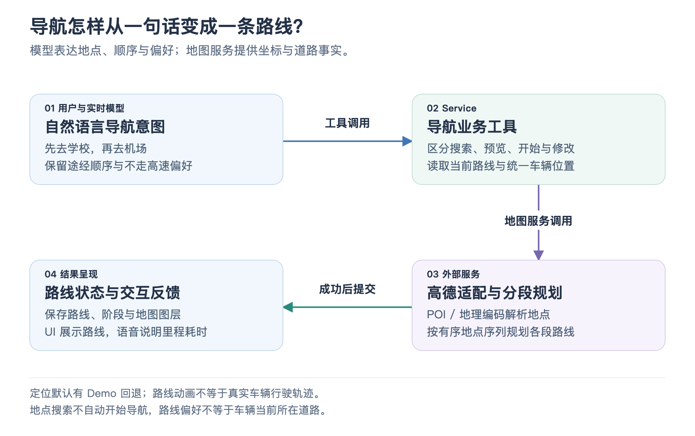

# 04 · 导航与位置服务

“先去学校接人，再去机场，别走高速。”这句话包含地点、顺序和路线偏好。模型可以理解这层意图，但地点坐标、道路路线和预计耗时需要由地图服务提供。导航模块连接的就是**自然语言要求与地图业务能力**。

## 模型与地图服务怎样分工

模型看到的是开始导航、预览路线、增删途经点、修改目的地、设置路线偏好等车机场景工具，共 12 个。高德的地点搜索、地理编码和驾车路线接口由 Service 编排，模型无需自行拼接全部底层 API。

[放大查看流程图](assets/navigation_flow.png)

“去机场”是业务目标，“机场的经纬度”是地点解析结果，“沿哪些道路走”是路线规划结果，“正在导航还是仅在预览”是座舱状态。把这几层分开，工具就可以稳定地处理后续修改。

## 多途经点路线怎样得到

首先，Service 获取起点，解析目的地和途经点的坐标。地点解析优先搜索 POI，也就是地图中的兴趣点，例如学校、商场或充电站；必要时补充地点详情，或用地址地理编码作为解析兜底。

然后，把起点、途经点、终点组成有序地点序列。上面的例子会按“当前位置 → 学校 → 机场”分别规划各段驾车路线，汇总距离和耗时，并保存各段路线折线与交通信息。这里的多途经点能力体现的是有序分段规划，不涉及重新求解一套自动最优巡游算法。

当前驾车路线调用高德 Web API，其他地图能力通过高德 MCP 接入。适配层把外部返回归一化为座舱能使用的结果；驾车请求在 Service 进程内限制发起间隔，并对部分可重试失败进行有限重试，以应对多段规划的限流问题。

地点或路线未能取得时，返回明确的失败结果；成功规划后才提交新的导航路线。前端活动事件可以展示“查找学校”“规划路线”等阶段，但这些进度不是导航完成的证明。

## 为什么还要维护导航状态

状态中保存目的地、途经点及坐标、路线偏好、当前路线、地图标记和视图设置。用户接着说“中途加个充电站”，执行器就能在当前路线的基础上增加地点、重新规划；说“目的地改成火车站”，则保留合适的已有信息并修改终点。

状态还区分空闲、路线预览和正在导航。问“去机场要多久”可以生成预览；明确说“导航去机场”进入导航。只搜索附近充电站，会返回 POI 候选，不改变已有导航。附近搜索没有结果时，也不会用查询词伪造一个地点或悄悄扩大为全市搜索。

“回家”所需的常用地点也由 Service 保存，可以来自已解析地址或当前位置。用户先选定结果再要求前往，搜索与导航就保持清晰的意图边界。

## 定位与路线偏好怎样保持一致

位置查询、导航起点和“把当前位置设为家”共用一份车辆位置。Service 提供定位适配入口，可以接入车机 GPS；未接真实定位时使用标注为 Demo 来源的默认位置。地图上的路线动画也不能据此证明车辆正在按这条路线实际移动。

用户在屏幕上修改路线偏好后，客户端会将 Service 确认的偏好通过场景事件静默同步到前台上下文。用户再问“现在是不走高速吗”，助手就能依据最新事实回答。这里同步的是偏好，不能推断车辆当前所在道路。

规划成功后，语音通常只简短播报总里程和预计耗时，完整目的地、途经点与路线留在结构化状态中供地图显示；用户追问路线详情时再展开。这让同一个结果同时适合驾驶时听和屏幕上看。

## 这个模块可以怎样讲

“导航模块把用户意图封装成业务工具，Service 负责地点解析与有序分段规划，再把路线和导航阶段写入统一状态。前台模型负责理解语义，地图服务提供坐标与道路事实，UI 展示路线并同步屏幕偏好。” 如果追问技术细节，就展开 POI、地理编码、路线折线、多途经点和请求限流。

事实对照

核心实现见 [导航执行器](../../service/tools/navigation/execute.mjs)、[工具设计](../../service/tools/navigation/README.md)、[高德服务适配](../../service/integrations/amap/services.mjs)、[高德 API 客户端](../../service/integrations/amap/client.mjs) 和 [统一定位定义](../../service/vehicle-location.mjs)。偏好同步见 [客户端场景事件](../../client/src/projections/environment-events.js) 与 [Gateway 事件校验和投影](../../gateway/environment-events.mjs)。

[地点搜索测试](../../service/test/place-search.test.mjs) 验证真实 POI、搜索范围以及搜索不修改导航；[高德客户端测试](../../service/test/amap-client.test.mjs) 和 [Service 测试](../../service/test/cockpit-service.test.mjs) 覆盖适配与路线业务。

[上一篇：车控、音乐与天气](03_vehicle_music_and_weather.md) · [返回目录](README.md) · [下一篇：后台 Agent 与资料研究](05_background_agent_and_research.md)
