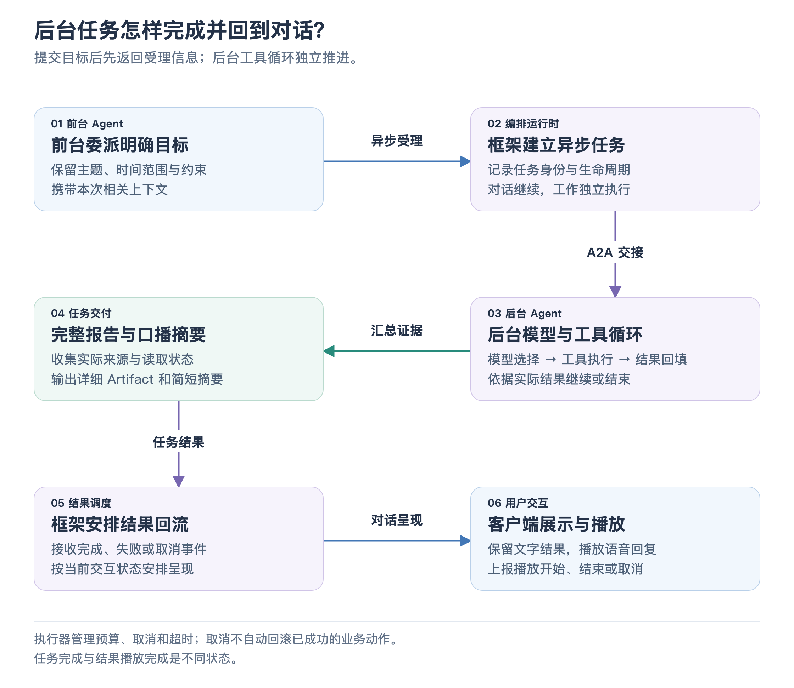

# 05 · 后台 Agent 与资料研究

用户说“整理今天的汽车行业新闻”，完成它可能需要多次搜索、阅读和筛选。后台 Agent 的职责是：**接收一个明确目标，让模型根据实际工具结果继续决定下一步，最终交付结果**。执行期间，前台的实时语音会话仍可以继续。

## 它从前台接到什么

前台把用户目标与必要约束交给框架的异步任务能力，例如主题、时间范围和篇幅。框架建立任务，通过 A2A 接到座舱 Agent。A2A 提供任务、进度和交付物的通信约定；后台 Agent 的模型与工具执行仍由座舱自己实现。

后台不会自动拿到前台的全部对话和长期记忆。因此“帮我找符合口味的餐食”这样的请求，需要前台把本次相关偏好纳入目标，同时保留用户当前的明确要求。

[放大查看流程图](assets/background_task_flow.png)

默认后台通过 DashScope 的 OpenAI 兼容接口使用 Qwen3.8-Flash。它发现当前后台工具目录，再组合框架提供的搜索与网页读取能力。默认后台座舱工具只有闪购；检索工具是另外组合的框架能力。

## 模型怎样持续办事

可以把执行过程理解为一个循环：给模型目标、必要历史和可用工具；模型提出工具调用；程序执行；实际结果加入本次消息；模型再决定继续调用还是结束。

新闻任务可能先搜索“当天汽车行业新闻”，看到来源后选择阅读其中几篇，再根据内容形成简报。工具返回失败时，模型有机会换查询或说明资料不足。决定步骤的是后台模型，执行搜索的是检索组件，执行座舱业务的是 Service。

执行器检查工具是否在当前目录内，并限制模型轮数、工具调用次数和任务总时长，避免无边界地循环。最后一轮保留给总结；达到工具预算时，停止新操作并整理已有结果。取消或超时仍有独立的任务终态，不能把它们包装成正常完成。

## “整理好了”怎样有依据

搜索结果与网页正文都有来源信息。执行器按 URL 收集引用，记录是只取得摘要还是成功读取原文，并保留可用发布日期、检索时间和失败信息。报告根据这些证据输出，而不是仅凭模型已有知识补一份“最新新闻”。

正文与简短口播在一次模型回复中分别表达：完整报告作为 A2A 文本 Artifact 交付，简短摘要作为最终状态信息返回。Artifact 可以理解为任务交付的完整内容，它不一定是磁盘上的文件。框架与客户端可以保留详细文本，同时让语音只介绍关键发现。

程序会补充实际来源及核验限制；没有取得来源时，报告路径返回明确的核验失败说明。对只读到搜索摘要、部分网页读取失败或沿用旧资料的情形，也保留相应限制。搜索与网页内容作为资料处理，不能成为授权调用车控或下单的指令。

## 任务状态与对话怎样连接

后台发布工作中、完成、失败或取消等事件，Gateway 映射成自己的任务语义并交给客户端。结果回到前台后，还需要安排适合的呈现时机和跟踪播放回执。这部分由框架完成，后台执行器无需自己控制浏览器扬声器。

执行器使用取消信号传递给模型、MCP 和检索请求，使正在进行的异步操作能停止。取消不会自动撤销此前已经成功的业务动作；后续工作需要查询实际状态，而不能认为整个流程已经回滚。

用户接着说“把刚才的报告缩短”，后台可利用相同 A2A Context 下的短期任务历史。默认在内存中保留最近 50 轮请求与最终回复，不重放旧工具调用；重启后清空。沿用先前来源修改报告时，会明确其并非刚重新检索的资料。

## 面试时可以讲的技术点

这个模块同时体现模型工具循环与工程控制：“模型决定步骤，执行器检查能力范围并管理取消与预算；实际工具结果回填，进度按任务事件返回；详细报告与口播摘要分开交付。” 以一次新闻请求举例，就能把 Agent 的工作方式讲具体。

事实对照

主要实现见 [CockpitAgentExecutor](../../agent/executor.mjs)、[模型适配](../../agent/model.mjs)、[工具组合](../../agent/tools.mjs)、[短期历史](../../agent/agent-history.mjs) 和 [A2A 服务](../../agent/server.mjs)。框架检索工厂见 [web-retrieval.mjs](../../../../server/src/frontend/retrieval/providers/web-retrieval.mjs)，结果调度见 [SessionTaskCoordinator](../../../../server/src/orchestration/session-task-coordinator.mjs#L12)。

[执行器测试](../../agent/test/executor.test.mjs) 覆盖多来源报告、无来源失败、摘要保留限制、取消与最终轮收尾；[历史测试](../../agent/test/agent-history.test.mjs) 和 [历史集成测试](../../agent/test/history.test.mjs) 覆盖连续任务上下文。

[上一篇：导航与位置服务](04_navigation_and_location.md) · [返回目录](README.md) · [下一篇：闪购与订单确认](06_flashbuy_and_confirmation.md)
