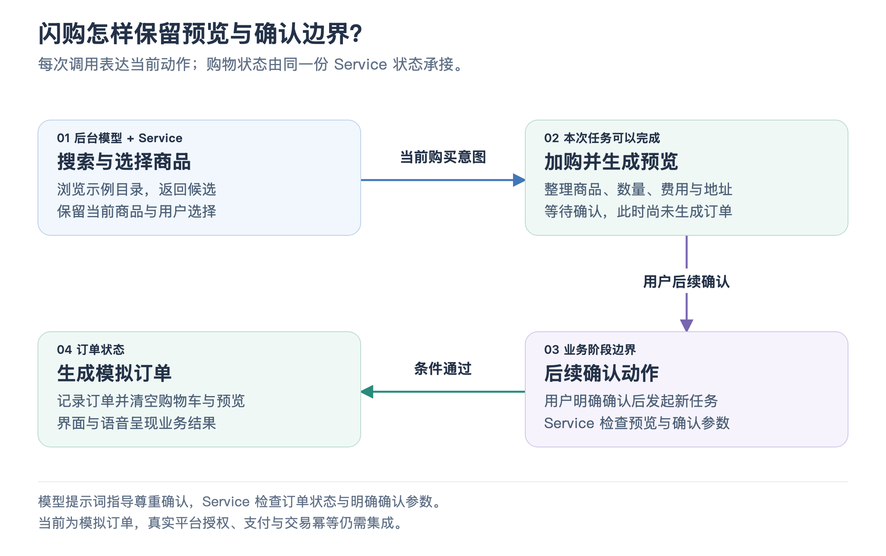

# 06 · 闪购与订单确认

“看看有哪些咖啡”“这杯加入购物车”“确认下单”，是三个不同意图。闪购模块把它们连接成一个可持续的流程，同时保留**预览与确认的边界**。默认它在后台执行，商品、购物车与订单状态由 Service 保存。

## 一项工具，表达多种业务动作

闪购只有一个 MCP 工具，通过动作参数区分搜索、加购、修改购物车、预览、确认下单和取消。这样的粒度把一类完整业务集中在同一工具内，又让每次调用的意图明确。

后台模型决定当前该执行哪个动作，Service 执行器根据动作处理业务状态。工具名称简单，不表示业务实现只有一步；加购动作本身就会继续生成订单预览。

[放大查看流程图](assets/flashbuy_flow.png)

## 为什么加购后先停在预览

浏览请求查询示例商品目录，并保存可选结果。加购请求根据商品或查询词选择条目、记录数量和选项，再计算购物车与订单预览。预览包含商品、配送地址、费用和预计送达时间，状态进入等待确认。

此时后台任务可以完成，把预览交给用户，但业务订单还没有生成。因此“后台任务已完成”在这里表示本次加购与预览工作完成，不表示商品已经购买。

用户后续明确确认时，前台再次发起后台工作。后台沿用 Service 中已有的预览，进入确认动作。前一个任务的结果可以帮助理解对话，当前业务事实仍来自购物车与预览状态。

## 确认如何落到业务层

Service 检查是否已有订单、是否存在可确认预览，以及确认参数是否明确为真。没有预览或未传入确认，就返回需要预览或确认的信息。已有订单时，返回已有结果，防止当前流程重复提交。

因此这里有两层约束：工具描述和后台提示词指导模型尊重用户确认；执行器检查订单状态与确认参数。确认参数仍由调用方填写，当前演示没有支付系统或独立的用户授权凭证，不能据此推断已经具备商用交易的完整授权与幂等机制。

确认成功后，执行器生成模拟订单、清空购物车和预览，并保存订单状态。界面通过 SSE 展示这些变化，语音通过任务结果说明订单。取消动作则清理当前闪购流程的相应状态。

## 业务数据与对话怎样协作

购物车条目、数量、总价、地址和预览保存于座舱状态中。模型无需从一句“我选了第二个”里重新生成商品价格，也无需把购物车永久塞进前台 Prompt。

当修改购物车时，旧预览会失效，以避免继续使用已经不对应当前商品的预览。这个做法体现了业务状态机的思路：允许哪些动作、动作后处于什么阶段，由执行器维护。模型主要承担意图理解与下一步选择。

## 当前实现与扩展方向

商品来自固定目录，费用和送达时间按演示规则计算，订单编号由程序生成。它展示了语音购买流程与 UI 联动，尚未对接真实商家、支付和骑手服务。

接真实平台时，可以保留搜索、加购、预览、确认这些业务语义，替换目录与订单执行适配，补充平台授权、真实库存价格、订单幂等和失败恢复。前后台通信与状态展示仍可复用现有边界。

面试中可以讲：“我理解闪购的重点是把自然语言购买意图拆成业务阶段。加购先生成可查看的预览，确认作为后续动作，Service 再检查状态并落地订单；任务完成与购买完成由此能够区分。”

事实对照

主要实现见 [闪购执行器](../../service/tools/flashbuy/execute.mjs)、[参数目录](../../service/tools/flashbuy/manifest.json)、[示例商品目录](../../service/tools/flashbuy/catalog.mjs)、[后台执行规则](../../agent/executor.mjs) 和 [前台委派说明](../../gateway/spawn-thinking-tool.mjs)。界面见 [FlashBuyPanel](../../client/src/components/FlashBuyPanel.jsx)。

[Service 测试](../../service/test/cockpit-service.test.mjs) 验证购物预览与确认条件，[HTTP/SSE 测试](../../service/test/server.test.mjs) 包含闪购活动推送，[后台集成测试](../../agent/test/integration.test.mjs) 验证任务与业务执行边界。

[上一篇：后台 Agent 与资料研究](05_background_agent_and_research.md) · [返回目录](README.md) · [下一篇：技能与环境事件](07_custom_skills_and_environment_events.md)
