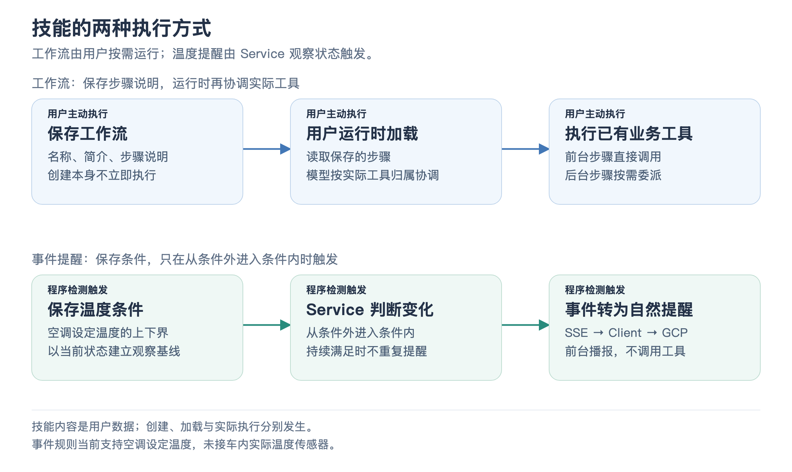

# 07 · 自定义技能与环境事件

用户说“记一个下班模式：空调调到 24 度，放音乐，再导航回家”，以后用一句“执行下班模式”完成这些动作。另一个需求是“设定温度到 20 度及以下时提醒我”。项目把它们分别实现为**工作流技能**与**事件提醒技能**。

## 两种技能分别保存什么

工作流保存名称、简介和步骤说明；事件提醒保存温度字段、上下界与提醒内容。它们按车机 ID 保存为 JSON 文件，重启 Service 后可以重新加载，同名更新沿用原有技能身份。客户端提供列表、详情和删除界面。

保存技能通过固定的列出、创建、加载三个工具完成。创建只是保存定义，加载只是读取定义；实际车控与导航仍使用已有业务工具。技能不会因为保存成功就立即执行，也不会动态生成新的 MCP 工具或扩大 Agent 的能力范围。

[放大查看流程图](assets/skills_event_flow.png)

## 一句“下班模式”怎样执行多个动作

前台识别用户想运行已有技能后，先读取保存的步骤。模型按照步骤调用温控、音乐和导航等实际工具；需要后台能力的步骤再委派后台。工具执行后，结果回填供模型继续判断。

所以当前工作流的底层是“保存步骤说明 + 模型按说明协调工具”，不是一个另行实现的通用 DAG 调度引擎。它能够复用自然语言与工具调用能力，实际执行顺序、错误后的继续方式和歧义处理仍需要模型与现有执行边界配合。

技能内容被当成用户保存的数据，不能覆盖系统规则、解除确认要求或调用不存在的工具。若步骤中有下单等行为，仍要尊重该业务的预览与确认条件。某一步已经成功，后续失败也不会自动撤销整套工作流。

## 温度提醒为什么用程序判断

事件技能支持的是**主驾、副驾或后排空调设定温度**，不是已接入的车内实际温度传感器。Service 保存结构化条件后监听自己的状态变化，用代码判断条件是否刚满足，不需要让模型一直轮询“温度到了吗”。

以“20 度及以下提醒”为例：25 → 19，进入条件，提醒一次；19 → 18，仍在条件内，不重复；18 → 25，离开条件，不提醒；之后 25 → 19，再次进入，可以再提醒。

创建、编辑或加载规则时，以当前状态建立观察基线。如果保存规则时已经是 19 度，保存本身不造成一次温度变化，也不会立刻触发提醒。服务在实际命令执行前准备好已保存规则，以免丢掉首次变化。

## 状态变化怎样变成一句提醒

Service 发出结构化活动事件，经 SSE 到客户端，再通过 GCP 的场景事件入口转给 Gateway。Gateway 校验温度字段、范围和进入条件的变化，再将它投影成适合前台使用的事实与播报要求。

前台据此自然说出提醒。提醒文字仍是用户内容，播报路径禁止借此调用工具；它不能把一句提醒升级成新的操作命令。这就把“确定条件是否满足”与“怎样自然表达提醒”分开了。

导航偏好也使用环境事件，但它进入上下文后保持静默；温度提醒则请求一次回应。场景信息是否该说出来由事件定义决定。客户端缓存最新偏好，短时缓存待发提醒，并让过期提醒失效，避免长时间断线后突然播报旧提醒。

## 这个设计为什么适合座舱

日常工作流通过模型复用已有工具，规则触发通过程序及时观察状态，语音模型只负责合适的表达。它们满足用户自定义与主动提醒的需求，同时使数据保存、业务执行和自然语言输出各有明确责任。

这里的座舱自定义技能，与框架给开发者后台安装的 Agent Skills 是不同功能。面试时可以用两个场景分别说明：“工作流按需加载后调用实际工具；温度规则由 Service 检测从条件外进入条件内，再通过环境事件让前台提醒。”

事实对照

定义保存见 [CustomSkillStore](../../service/custom-skills/store.mjs)，固定工具见 [执行器](../../service/tools/custom-skills/execute.mjs) 与 [参数目录](../../service/tools/custom-skills/manifest.json)。温度条件见 [TemperatureSkillRules](../../service/custom-skills/temperature-rules.mjs)。事件传递见 [客户端投影与待发缓存](../../client/src/projections/environment-events.js) 和 [Gateway 场景事件](../../gateway/environment-events.mjs)。

[温度规则测试](../../service/test/temperature-skills.test.mjs) 验证进入条件、加载基线、首次变化与删除刷新；[技能存储测试](../../service/test/custom-skill-store.test.mjs) 验证持久化；[Gateway 事件测试](../../gateway/test/environment-events.test.mjs) 验证静默偏好与无工具提醒。

[上一篇：闪购与订单确认](06_flashbuy_and_confirmation.md) · [返回目录](README.md) · [下一篇：记忆、人设与上下文](08_memory_persona_and_context.md)
