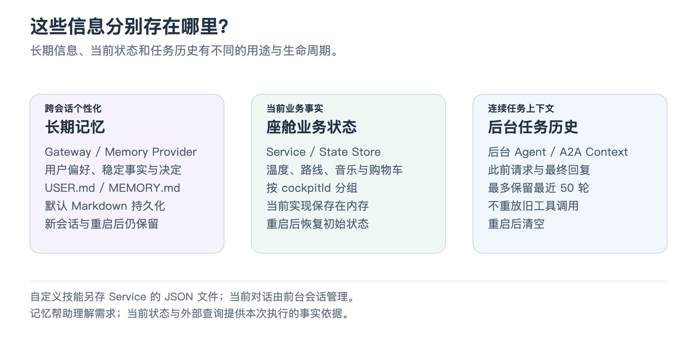

# 08 · 记忆、人设与上下文

“记住我喜欢烧烤，不太能吃辣”，与“当前空调是 24 度”，都能影响回答，但它们的来源与生命周期不同。这个模块让助手保存长期信息、使用合适人设，并理解当前环境，同时维持各类信息的边界。

## 先把几种信息分开

[放大查看对照图](assets/memory_context_flow.png)

| 信息 | 保存位置与作用 | 生命周期 |
|---|---|---|
| 用户偏好与长期事实 | Gateway 的 Memory Provider，用于跨会话理解用户 | 默认写入 Markdown，重启后仍保留 |
| 座舱业务状态 | Service，例如温度、路线与购物车 | 当前实现保存在内存 |
| 自定义技能 | Service 的技能文件，例如下班模式或温度规则 | JSON 持久化，独立于状态快照 |
| 后台任务历史 | 后台 Agent，保存此前请求与最终回复 | 有界内存历史，重启后清空 |
| 当前对话与环境上下文 | 前台会话，用于理解本轮指代与最新状态 | 由会话与恢复机制管理 |

知道存在哪里，才能回答“为什么重启后这项信息还在，而另一项不在”。也能避免把昨天报告里的执行结果，当成今天的当前车辆状态。

## “记住我的口味”怎样保存

座舱使用框架标准记忆工具。模型把明确的保存要求交给 Memory Provider，默认实现将用户偏好放进 `USER.md`，稳定事实与决定放进 `MEMORY.md`。运行时读取有界快照，构建前台上下文，用户新建对话后仍可使用这些信息。

记忆写入支持追加、精确替换与删除。替换时要求原文唯一匹配，客户端删除还携带文档版本；发现版本过期就重新读取，避免覆盖别人刚更新的内容。保存后的数据既用于模型，也用于记忆面板，面板无需维护另一套记忆库。

写入成功且发生变化时，Gateway 发送记忆变更事件，客户端再读取最新文档。模型上下文刷新与面板刷新各有路径，因此不能只从助手说“我记住了”来推断持久化已完成。

框架还支持在会话结束后自动整理稳定信息，受模型配置与开关控制；显式记忆操作和自动整理共用运行时边界。自动整理是额外的模型处理，可能提取错误，用户仍需要能够查看与纠正。默认记忆方案无需额外向量数据库，语义召回能力可由其他 Provider 扩展。

## 人设怎样切换，为什么不改业务规则

客户端展示温柔、行动派等人设选项，发送一个允许的人设 ID。Gateway 校验 ID 后读取可信的人设 Markdown，在合适的空闲点更新同一实时会话的指令。

人设决定身份和表达风格，例如回答更简短或更有行动感；工具执行面和后台委派边界来自独立配置与工具定义。用户选择人设不会因此多出一个可下单或控制车辆的权限。

框架构建上下文时还区分核心规则、用户当前要求、长期偏好、默认人设与事实记忆。用户当前明确说“今天想吃清淡一点”，回答不能被过去的“喜欢烧烤”机械覆盖。长期事实用于帮助理解，不承担授权工具操作的职责。

## 偏好怎样参与一次推荐

用户问“附近有什么合口味的餐厅”，前台可以根据口味记忆生成合适的地点搜索关键词，例如“烧烤”。Service 返回真实 POI 后，模型再解释候选及待核实条件。

“不太能吃辣”是筛选和介绍时的重要条件，但地图搜索结果不一定包含菜品辣度、菜单或过敏原信息。因此模型不能只凭一个店名保证餐厅满足这些限制。搜索的作用是提供真实地点，记忆的作用是帮助理解需求，两者共同支持推荐。

知识库则回答外部资料中的问题，属于另一种 Provider 能力。框架可接 RAG 或企业知识系统，但当前座舱没有显式搭建自己的知识库。介绍项目时可以说它具备扩展接口，再将已实现的记忆和网页检索分别说明。

## 面试时可以怎样概括

“个性化复用框架的 Memory Provider 与人设配置。默认长期记忆使用 Markdown 持久化，语音工具和界面管理共用同一存储；车机状态、技能和后台历史分别保存。推荐结合偏好与实际搜索结果，而不是把记忆本身当作商家事实。”

事实对照

记忆原理见 [Memory Provider](../../../../docs/reference/memory-provider.zh.md)，实现见 [FrontendMemoryRuntime](../../../../server/src/memory/runtime.mjs#L53)、[Markdown Provider](../../../../server/src/memory/providers/markdown/provider.mjs) 和 [文档编辑存储](../../../../server/src/memory/providers/markdown/context-store.mjs)。面板见 [useGatewayMemory](../../client/src/hooks/useGatewayMemory.js)，人设见 [可信 Profile 事件](../../gateway/assistant/event.mjs)。

[记忆会话测试](../../gateway/test/memory-session.test.mjs) 验证人设刷新仍保留工具与记忆；[面板同步测试](../../client/test/memory-sync.test.mjs) 验证版本冲突与刷新；[偏好场景测试](../../test/preference-memory.test.mjs) 验证记忆与地点搜索规则。

[上一篇：技能与环境事件](07_custom_skills_and_environment_events.md) · [返回目录](README.md) · [下一篇：客户端与界面联动](09_client_and_voice_ui_sync.md)
