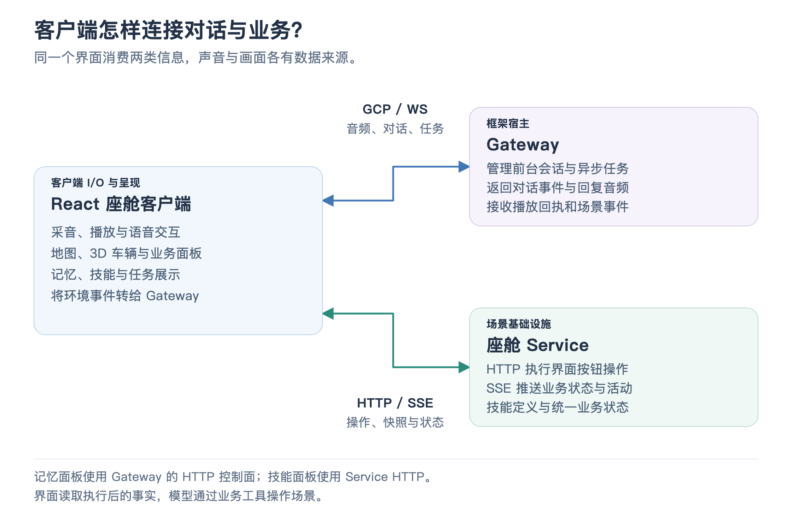

# 09 · 客户端与界面联动

用户说“打开车窗”，3D 车辆显示相应变化；规划路线时，地图显示查找与路线阶段；后台研究进行中，任务面板继续显示进度。这些画面由客户端把业务状态和事件转换为 UI，而不是要求模型生成一串页面控制命令。

## 客户端连接哪两类服务

React 客户端连接 Gateway，处理音频、对话文字、任务消息和播放回执；同时连接 Service，获取座舱快照、执行按钮操作、订阅状态和活动事件。记忆管理通过 Gateway 的独立 HTTP 控制面完成，技能管理通过 Service 完成。

[放大查看通道图](assets/client_channels.png)

这样的分工允许界面更换而不改变模型工具。模型通过业务工具表达操作，界面根据结构化结果决定怎样呈现。

## 状态怎样成为屏幕上的画面

客户端将 Service 的状态投影为各面板需要的数据。温度进入空调控件，媒体状态进入音乐卡片，导航结果进入地图图层，购物车与订单进入闪购面板。按变化领域更新，可以保留未变化对象，减少无关界面更新。

3D 车辆使用 Three.js 与 React Three Fiber，加载 GLB 车辆模型，根据车窗、天窗、行李箱和灯光等状态调整模型部件与材质。这里的动画是业务状态的视觉反馈，车辆模型资源不是设备控制接口。

地图使用高德 JS SDK，把 Service 返回的坐标、路线折线和交通片段绘制为标记与道路图层。查找地点等活动事件还能驱动阶段提示和预览动画。路线流动和相机移动让演示更直观，其运动效果不代表已获得真实车辆行驶轨迹。

## 语音播放为什么也需要状态管理

浏览器通过麦克风接口采集音频，Web Audio 负责处理和播放。回复音频按块返回，客户端依次安排播放，并在开始、结束或取消时上报对应回执。打断或静音时，需要停止未播放完的音频，并把取消信息传回框架。

麦克风权限、浏览器音频上下文是否激活、用户希望开启语音，是不同条件。客户端分别处理这些条件并显示错误；解除静音的意图不应因为麦克风授权失败就被错误当成没有发生。语音交互依赖浏览器策略，实际体验还需要人工检查。

音色选择使用框架的会话级接口，Gateway 将偏好交给 Provider；对于默认 Qwen Audio 服务，动态换音色会重建上游模型会话，客户端 Gateway 连接保持原有会话边界。人设切换则更新可信 Profile，处理方式与换音色不同。

## 消息很多时，怎样让界面保持可理解

客户端对任务进度做语义去重，避免同一阶段反复刷新提示；对终态安排清理；对连续请求的结果保留最新版本，避免旧请求迟到覆盖新状态。环境事件缓存最新导航偏好，对短时提醒设置过期限制。

SSE 连接断开时，浏览器 EventSource 会尝试重连；服务的新连接发送当前快照。Gateway 的客户端 SDK 处理对话连接与恢复。恢复的目的都是重新获得当前事实，而不是把所有历史动画从头播放一遍。界面刷新时，示例还会请求停止遗留导航会话，避免旧路线与新页面状态混淆。

## 这个模块的技术价值

面试时可以讲：“客户端同时消费对话事件与业务状态，两种通道的职责明确。React 展示结构化投影，Three.js 与地图 SDK 提供视觉反馈；音频播放回执、进度去重和重连快照，让异步执行在界面上保持可理解。” 这样能把 UI 的实现与系统协作讲在一起。

事实对照

界面装配见 [App.jsx](../../client/src/App.jsx)，语音见 [useVoiceSession](../../client/src/hooks/useVoiceSession.js) 与 [voiceSessionMode](../../client/src/hooks/voiceSessionMode.js)，业务订阅见 [useCockpitState](../../client/src/hooks/useCockpitState.js)。视觉实现见 [CarModel3D](../../client/src/components/CarModel3D.jsx) 和 [MapPanel](../../client/src/components/MapPanel.jsx)，数据投影见 [任务进度](../../client/src/projections/task-progress.js) 与 [座舱状态](../../client/src/projections/cockpit-state.js)。

[语音模式测试](../../client/test/voice-session-mode.test.mjs)、[音频激活测试](../../client/test/audio-activation.test.mjs)、[任务进度测试](../../client/test/task-progress.test.mjs) 和 [路线动画测试](../../client/test/route-flow.test.mjs) 验证相关行为。默认模型换音色方式见 [Realtime 配置说明](../../../../docs/voice-frontends/qwen-audio-realtime.zh.md)。

[上一篇：记忆、人设与上下文](08_memory_persona_and_context.md) · [返回目录](README.md) · [下一篇：工程装配与评测](10_engineering_and_evaluation.md)
